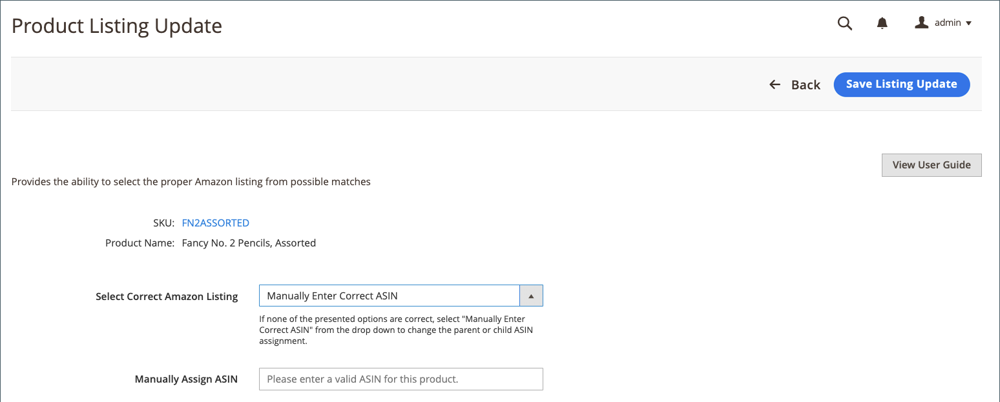

# Aggiorna informazioni richieste (elenco incompleto)

Inserzioni visualizzate sul _[!UICONTROL Incomplete]_la scheda include il [!DNL Commerce] cataloga i prodotti che soddisfano i requisiti di idoneità di Amazon definiti nelle regole di inserzione, ma per i quali mancano le informazioni richieste da Amazon prima dell’inserzione.

## Aggiorna le informazioni richieste (impossibile assegnarle all’elenco di Amazon) {#update-required-info-unable-to-assign-to-amazon-listing}

1. Visualizza le inserzioni in _[!UICONTROL Incomplete]_scheda in [Gestisci le inserzioni](./managing-product-listings.md).

1. In _[!UICONTROL Action]_, fare clic su **[!UICONTROL Select]**>**[!UICONTROL Update Required Info]**per l’inserzione da aggiornare.

1. Esamina le informazioni sul prodotto del catalogo (SKU e Nome prodotto) per le quali stai tentando di ottenere una corrispondenza con un’inserzione di Amazon.

1. Per **[!UICONTROL Assign ASIN]**, immetti il codice ASIN assegnato da Amazon per l&#39;inserzione che desideri associare al prodotto del catalogo.

1. Per salvare la corrispondenza del prodotto, fai clic su **[!UICONTROL Save Listing Update]**.

L’inserzione ora corrisponde al tuo catalogo e viene aggiornata e pubblicata in Amazon in base alle impostazioni della tua cron e dell’inserzione. Viene rimosso anche dal _[!UICONTROL Incomplete]_scheda.

{width="600" zoomable="yes"}

## Aggiorna informazioni richieste (trovate più corrispondenze) {#update-required-info-multiple-matches-found}

1. Visualizza le inserzioni in _[!UICONTROL Incomplete]_scheda in [[!UICONTROL Manage Listings]](./managing-product-listings.md).

1. In _Azione_ , fare clic su **Seleziona** > **Aggiorna informazioni richieste** per l’inserzione da aggiornare.

1. Esamina le informazioni sul prodotto del catalogo (SKU e Nome prodotto) per le quali stai tentando di ottenere una corrispondenza con un’inserzione di Amazon.

1. Per **[!UICONTROL Select Correct Amazon Listing]**, scegli il codice ASIN corretto per l&#39;inserzione che desideri associare a questo prodotto.

   Le opzioni elencate includono i prodotti del catalogo identificati come possibili corrispondenze. Se nessuna delle opzioni è corretta, puoi scegliere `Manually Enter Correct ASIN` e immettere manualmente il codice ASIN per il prodotto.

1. Se si immette manualmente il codice ASIN, immettere il codice ASIN corretto per **[!UICONTROL Manually Assign ASIN]**.

1. Per salvare la corrispondenza del prodotto, fai clic su **[!UICONTROL Save Listing Update]**.

{width="600" zoomable="yes"}

## Aggiorna informazioni richieste (con varianti) {#update-required-info-has-variants}

1. Visualizza le inserzioni in _[!UICONTROL Incomplete]_scheda in [[!UICONTROL Manage Listings]](./managing-product-listings.md).

1. In _[!UICONTROL Action]_, fare clic su **[!UICONTROL Select]**>**[!UICONTROL Update Required Info]**per l’inserzione da aggiornare.

1. Esamina le informazioni sul prodotto del catalogo (SKU e Nome prodotto) per le quali stai tentando di ottenere una corrispondenza con un’inserzione di Amazon.

1. Per **[!UICONTROL Select Correct Amazon Listing]**, scegli il codice ASIN corretto per l&#39;inserzione che desideri associare a questo prodotto.

   Le opzioni elencate includono i prodotti del catalogo identificati come possibili corrispondenze. Se nessuna delle opzioni è corretta, puoi selezionare `Manually Enter Correct ASIN` e immettere manualmente il codice ASIN per il prodotto.

1. Se si immette manualmente il codice ASIN, immettere il codice ASIN corretto per **[!UICONTROL Manually Assign ASIN]**.

1. Per salvare la corrispondenza del prodotto, fai clic su **[!UICONTROL Save Listing Update]**.

## Aggiorna informazioni richieste (condizione mancante) {#update-required-info-missing-condition}

1. Visualizza le inserzioni in _[!UICONTROL Incomplete]_scheda in [Gestisci le inserzioni](./managing-product-listings.md).

1. In _[!UICONTROL Action]_, fare clic su **[!UICONTROL Select]**>**[!UICONTROL Update Required Info]**per l’inserzione da aggiornare.

1. Esamina le informazioni sul prodotto del catalogo (SKU e Nome prodotto) per le quali stai tentando di ottenere una corrispondenza con un’inserzione di Amazon.

1. Per **[!UICONTROL Condition]**, scegli la condizione appropriata.

   L’elenco delle opzioni disponibili dipende da [Condizione elenco prodotti](./product-listing-condition.md) impostazioni.

1. Per salvare la corrispondenza del prodotto, fai clic su **[!UICONTROL Save Listing Update]** .

{width="600" zoomable="yes"}
