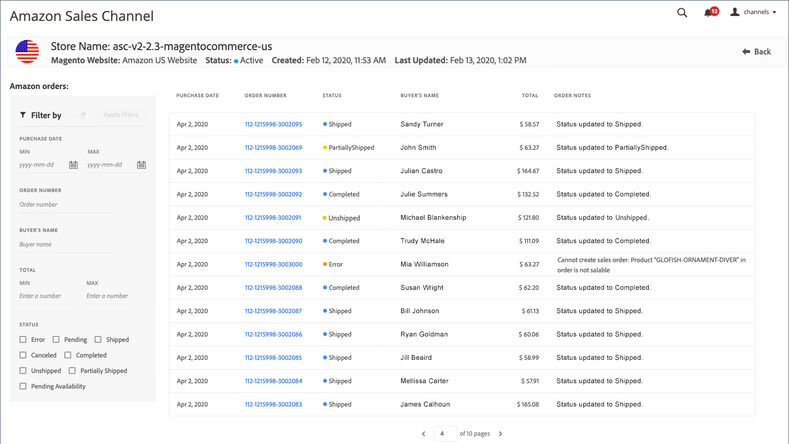

# Visualizzare gli ordini di Amazon

Esistono due modi per visualizzare gli ordini Amazon: _[!UICONTROL Recent Orders]_e_[!UICONTROL All Orders]_.

Entrambe le opzioni mostrano le informazioni di base sull’ordine ricevute da Amazon, tra cui:

- Data acquisto
- Numero ordine
- Stato
- Nome dell&#39;acquirente
- Totale complessivo
- Note ordine

_[!UICONTROL All Orders]_visualizza aggiunge opzioni di filtro per le ricerche nell&#39;ordine.

>[!NOTE]
>
>Ad eccezione della colonna _[!UICONTROL Order Notes]_, nella tabella_[!UICONTROL Amazon orders]_ vengono inserite le informazioni sull’ordine ricevute da Amazon. La colonna _Note ordine_ viene aggiornata da [!DNL Commerce] come l&#39;ordine elabora.

## Ordini recenti

Puoi visualizzare gli ordini più recenti nella sezione _[!UICONTROL Recent Orders]_del [dashboard dell&#39;archivio](./amazon-store-dashboard.md).

### Visualizzare gli ordini recenti di Amazon

1. Fai clic su **[!UICONTROL View Store]** su una scheda del negozio.

1. Visualizza gli ordini nella sezione _[!UICONTROL Recent Orders]_.

1. Per visualizzare i dettagli dell’ordine, fai clic sul numero dell’ordine Amazon nella colonna _[!UICONTROL Order Number]_.

   Viene visualizzata la pagina _[!UICONTROL Amazon Order Details]_dell’ordine.

## Visualizza tutti gli ordini

Puoi visualizzare tutti gli ordini Amazon nella pagina _[!UICONTROL Amazon orders]_(detta anche visualizzazione_[!UICONTROL All Orders]_). La tabella Ordini di Amazon è simile alla sezione _[!UICONTROL Recent Orders]_del dashboard del negozio, ma consente di visualizzare tutti gli ordini di Amazon e di restringere l’elenco degli ordini con le seguenti opzioni di filtro:

- [!UICONTROL Purchase Date (range)]
- [!UICONTROL Order Number]
- [!UICONTROL Buyer's Name]
- [!UICONTROL Total (range)]
- [!UICONTROL Status]

### Visualizza tutti gli ordini di Amazon

1. Fai clic su **[!UICONTROL View Store]** su una scheda del negozio.

1. Fare clic su **[!UICONTROL All Orders]** nella sezione _[!UICONTROL Recent Orders]_.

1. Per limitare l’elenco o cercare un numero di ordine specifico, completare i parametri **[!UICONTROL Filter by]** e fare clic su **[!UICONTROL Apply filters]**.

1. Per visualizzare i dettagli dell’ordine, fai clic sul numero dell’ordine Amazon nella colonna _[!UICONTROL Order Number]_.

   Viene visualizzata la pagina _[!UICONTROL Amazon Order Details]_dell’ordine.

## Utilizzo dei filtri

Puoi applicare i filtri all’elenco degli ordini nella sezione _[!UICONTROL Filter by]_. Effettua le selezioni e fai clic su **[!UICONTROL Apply filters]**. I filtri applicati vengono visualizzati sopra la griglia degli ordini.

### Modifica dei filtri applicati

- Puoi aggiungere o modificare i filtri nella sezione _[!UICONTROL Filter by]_. Fare clic su **[!UICONTROL Apply filters]**per aggiornare l&#39;elenco degli ordini e le opzioni di filtro visualizzate sopra la griglia degli ordini.

- Per rimuovere i filtri, uno alla volta, fai clic sul simbolo `x` del filtro oppure tutti insieme facendo clic su **[!UICONTROL Clear all filters]**. La rimozione di un filtro aggiorna l’elenco degli ordini e le opzioni filtro visualizzate sopra la griglia degli ordini.

- Se l&#39;elenco degli ordini è lungo, è possibile utilizzare i controlli di impaginazione sotto la griglia per visualizzare altri ordini.

>[!TIP]
>
>Alcuni suggerimenti sulla visualizzazione degli ordini:
>
>- Se disponi di più integrazioni Amazon Store, potrebbe essere necessario aggiornare la visualizzazione della pagina quando si passa da una visualizzazione store all&#39;altra per aggiornare sia l&#39;elenco degli ordini che le visualizzazioni di impaginazione per l&#39;archivio corrente.
>- Quando si effettua l’ordinamento per colonna, questo si applica solo alla vista elenco corrente. È consigliabile filtrare l’elenco e quindi ordinare la pagina da visualizzare.
>- A seconda della larghezza della finestra di visualizzazione, è possibile che nelle colonne sia presente una sovrapposizione del testo. Per espandere le colonne del testo da mandare a capo, allargate la visualizzazione della finestra.
>- Quando filtri per _[!UICONTROL Total]_, filtra per numeri interi. L&#39;immissione di un importo decimale può causare errori nei risultati.

### Colonne predefinite

| Colonna | Descrizione |
|---|---|
| [!UICONTROL Filter by] | Disponibile solo nella visualizzazione _[!UICONTROL All Orders]_. Limita l’elenco degli ordini in base a:<ul><li>`Purchase Date (range)`</li><li>`Order Number`</li><li>`Buyer's Name`</li><li>`Total (range)`</li><li>`Status`</li></ul> |
| [!UICONTROL Purchase Date] | La data dell’acquisto, come ricevuta da Amazon. |
| [!UICONTROL Order Number] | Numero dell’ordine generato da e ricevuto da Amazon. Per visualizzare la schermata Dettagli ordine di Amazon, fai clic sul collegamento . |
| [!UICONTROL Status] | Lo stato dell’ordine ricevuto da Amazon. Opzioni: `Error` / `Pending` / `Shipped` / `Canceled` / `Completed` / `Unshipped` / `PartiallyShipped` / `PendingAvailability` |
| [!UICONTROL Buyer's Name] | Nome della persona che ha effettuato l’ordine, come ricevuto da Amazon. |
| [!UICONTROL Grand Total] | Il valore della valuta totale dell&#39;ordine, come ricevuto da Amazon. |
| [!UICONTROL Order Notes] | L&#39;azione più recente registrata per l&#39;ordine durante l&#39;elaborazione in [!DNL Commerce]. Le informazioni includono, tra l’altro, errori di importazione degli ordini e aggiornamenti dell’elaborazione degli ordini. **Nota**: Questo campo viene aggiornato da  [!DNL Commerce] come l’ordine elabora. |
