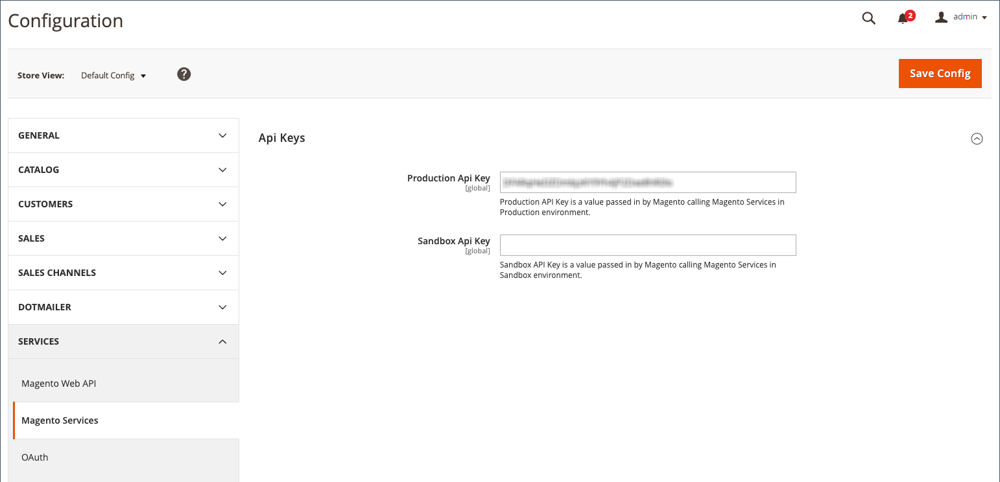

# Aggiungere o verificare la chiave API di Amazon

Quando si accede al canale di vendita Amazon, [!DNL Commerce] verifica e convalida automaticamente la chiave API di Amazon aggiunta nella configurazione dell’archivio. Se convalidata, puoi passare al passaggio successivo, [Integrazione store](./store-integration.md).

Se la chiave API di Amazon è mancante, non valida o scaduta, devi aggiornarla. Viene visualizzato un messaggio che richiede di ottenere una chiave API e di aggiungerla alla configurazione del canale di vendita Amazon.

## Ottieni e aggiungi la chiave API di Amazon come richiesto

La chiave API viene convalidata ogni volta che accedi al tuo canale di vendita Amazon.

1. Accedi a [!DNL Commerce] Amministratore

1. Il giorno _[!UICONTROL Admin]_barra laterale, vai a **[!UICONTROL Marketing]**>_[!UICONTROL Channels]_ > **[!UICONTROL Amazon Sales Channel]**.

   Se è la prima volta che accedi al canale di vendita Amazon o se la tua chiave API richiede un aggiornamento, il sistema ti chiederà di completare la procedura.

   {width="500"}

1. Clic **[!UICONTROL Sign in]** per accedere al [!DNL Commerce] account web.

   La pagina Account Commerce si apre in una nuova scheda del browser.

   - Se hai effettuato l’accesso a [!DNL Commerce] account, il _[!UICONTROL API Portal]_sezione del_[!UICONTROL My Account]_ viene visualizzata automaticamente.

   - Se non è stato eseguito l&#39;accesso, verrà richiesto di immettere [!DNL Commerce] nome utente e password dell’account prima del _[!UICONTROL API Portal]_viene visualizzata la scheda.

   - Se non disponi di un account, visita [il [!DNL Commerce] pagina account](https://account.magento.com/customer/account/login/){target="_blank"} e registrarsi. Questo account deve far parte della tua azienda o attività.

1. Se necessario, puoi visualizzare e generare chiavi API sul _[!UICONTROL API Portal]_nella scheda [!DNL Commerce] account.

   Per creare una chiave API, immetti una descrizione come `Amazon Sales Channel` e fai clic su **[!UICONTROL Add New]**. La nuova chiave viene generata e visualizzata con il nome immesso. Clic **[!UICONTROL Copy]** per copiare la nuova chiave.

   {width="500" zoomable="yes"}

1. Con la nuova chiave generata e copiata, torna a _[!UICONTROL Amazon Sales Channel]_nel browser.

1. Il giorno _[!UICONTROL Welcome to Amazon Sales Channel]_pagina, fai clic su **[!UICONTROL Add the key]**.

   Il browser esce dal canale di vendita di Amazon e viene visualizzata una pagina di configurazione del negozio _[!UICONTROL Api Keys]_pagina in [!DNL Commerce] Amministratore Puoi aprire questa pagina manualmente quando vai a **[!UICONTROL Stores]**>_[!UICONTROL Settings]_ > **[!UICONTROL Configuration]**, espandi **[!UICONTROL Services]** nel pannello a sinistra, quindi scegliete **[!UICONTROL Magento Services]**.

1. Incolla la chiave copiata per **[!UICONTROL Production Api key]**.

1. Clic **[!UICONTROL Save Config]**. Ora puoi tornare al canale di vendita Amazon.

   {width="600" zoomable="yes"}

1. Il giorno _[!UICONTROL Admin]_barra laterale, vai a **[!UICONTROL Marketing]**>_[!UICONTROL Channels]_ > **[!UICONTROL Amazon Sales Channel]**.

   Riaccesso ai trigger del canale di vendita Amazon [!DNL Commerce] verifica e convalida la chiave API e consente di continuare.

   Se viene richiesto di verificare nuovamente il tasto, ripetere l&#39;operazione _Aggiungi e verifica_ processo.

 [**Continua a memorizzare l&#39;integrazione**](./store-integration.md)
