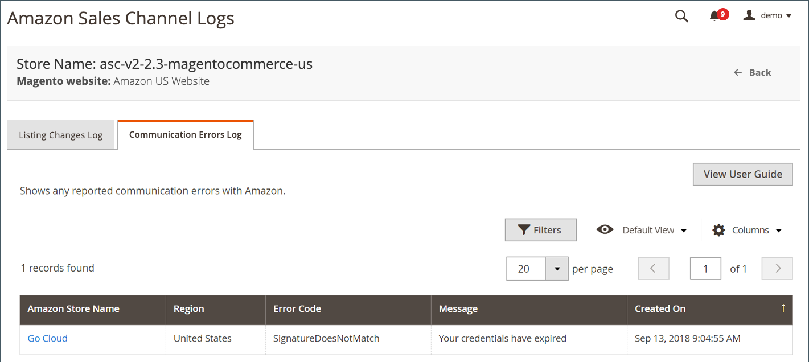

# Registro degli errori di comunicazione di Amazon

Il registro [!UICONTROL Communication Errors] mostra eventuali errori di comunicazione segnalati con Amazon. Le informazioni includono il negozio del canale di vendita Amazon interessato, il codice di errore e una breve descrizione, nonché la data e l’ora dell’errore.

Nessuna azione disponibile per il registro. È una funzione di sola revisione.

Le home page del canale di vendita Amazon condividono alcuni [controlli dell&#39;area di lavoro](./workspace-controls.md) comuni che consentono di personalizzare i dati visualizzati.

{width="600" zoomable="yes"}

## Colonne predefinite

| Colonna | Descrizione |
|--------------------------------|-----------------------------------------------------------------------------------------------------------------------|
| [!UICONTROL Amazon Store Name] | Il nome dell’archivio definito al momento della configurazione dell’archivio Amazon. Consulta [Integrazione store](./store-integration.md). |
| [!UICONTROL Error Code] | Codice ricevuto da Amazon per identificare il tipo di errore. |
| [!UICONTROL Message] | Messaggio che descrive l’errore associato al codice di errore. |
| [!UICONTROL Created On] | La data e l’ora in cui si è verificato l’errore. |
