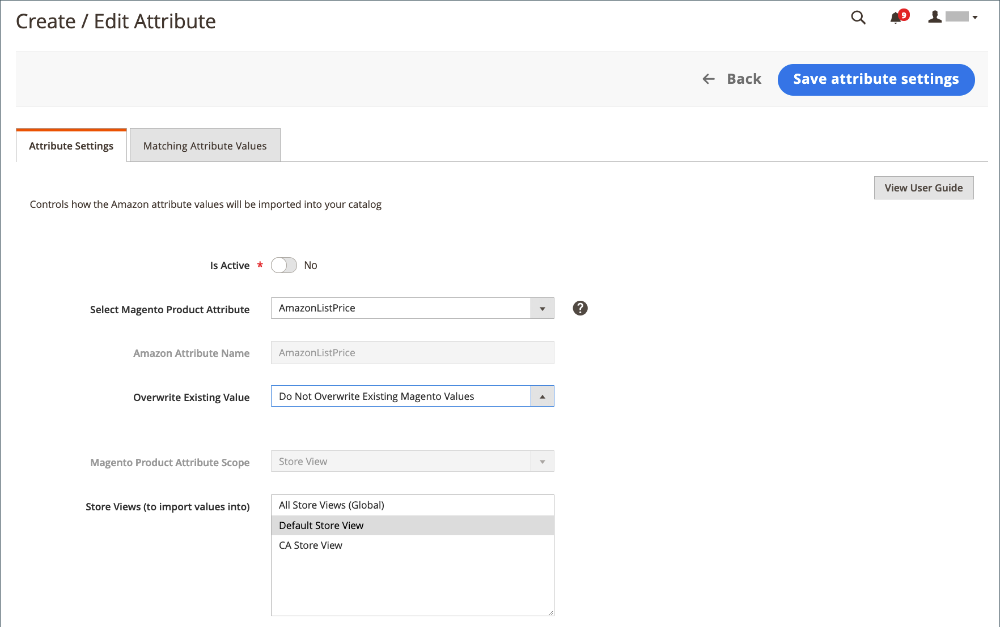

# Creare e modificare gli attributi

Crea o aggiorna gli attributi [!DNL Commerce] durante la vendita tramite Amazon e l&#39;aggiornamento degli archivi. Rivedi gli attributi Amazon correnti e gli attributi collegati [!DNL Commerce] tramite la [_[!UICONTROL Attributes]_view](./attributes-view.md) della home page del canale di vendita Amazon. La colonna_[!UICONTROL Action]_ mostra le azioni disponibili per l’attributo . Puoi creare e mappare un nuovo attributo [!DNL Commerce] per un attributo Amazon non collegato oppure modificare un attributo [!DNL Commerce] esistente e il relativo mapping a un attributo Amazon.

Quando crei e aggiorni gli attributi, puoi verificare i valori degli attributi per i prodotti [!DNL Commerce] e Amazon. Questi valori possono essere diversi se non si sincronizzano e si importano valori da Amazon. Per esaminare i valori di Amazon per questi attributi, consulta [Revisione della mappatura degli attributi di Amazon](./amazon-matching-attributes-values.md). Se desideri modificare tali valori, puoi [modificare o creare una mappatura](./amazon-manually-update-incomplete-listing.md) tra Amazon e [!DNL Commerce].

## Creare un attributo {#create-an-attribute}

Questi passaggi creano un attributo [!DNL Commerce] e lo mappano su un attributo Amazon. A seconda delle configurazioni, i valori possono iniziare la sincronizzazione tra i cataloghi.

1. Nella barra laterale _Amministratore_, vai a **[!UICONTROL Marketing]** > _[!UICONTROL Channels]_>**[!UICONTROL Amazon Sales Channel]**.

1. Fai clic su **[!UICONTROL Attributes]** nel menu a sinistra, individua un attributo di Amazon e fai clic su **[!UICONTROL Create Attribute]** nella colonna _[!UICONTROL Action]_.

1. Per abilitare la sincronizzazione dei valori Amazon con l&#39;attributo collegato [!DNL Commerce], imposta **[!UICONTROL Is Active]** su `Yes`.

   Se è impostato su `Yes`, i valori vengono sincronizzati in base alla configurazione.

1. Scegli `Create New Magento Attribute` per **[!UICONTROL Select Magento Product Attribute]**.

   L’attributo viene mappato sul valore scelto per **[!UICONTROL Amazon Attribute Name]**.

1. Immetti un **[!UICONTROL Magento Product Attribute Name]**.

1. Immetti un **[!UICONTROL Magento Product Attribute Code]**.

   Questo valore deve essere tutto minuscolo senza spazi.

1. Per **[!UICONTROL Attribute Set Ids]**, scegli un set di attributi da assegnare.

   In genere, gli attributi fanno parte di un set di attributi, ad esempio un set per i colori con attributi per blu, verde, giallo e rosso.

1. Per **[!UICONTROL Type]**, scegli il tipo di valore dell&#39;attributo, ad esempio testo e numeri.

   Questa opzione influisce sul valore consentito per l&#39;attributo.

1. Per **[!UICONTROL Use for Promo Rule Conditions]**, imposta su `Yes` per consentire all’attributo di essere disponibile per un parametro nelle condizioni promozionali.

1. Per **[!UICONTROL Used in Search]**, imposta su `Yes` se l’attributo e il valore possono essere utilizzati nelle ricerche di prodotto.

1. Per **[!UICONTROL Comparable on Storefront]**, imposta su `Yes` se il valore dell&#39;attributo può essere utilizzato nella funzionalità &quot;Confronta per&quot; di Amazon.

1. Scegli l&#39; [!DNL Commerce] [ambito](https://docs.magento.com/user-guide/configuration/scope.html){target=&quot;_blank&quot;} per l&#39;attributo, quindi seleziona una o più visualizzazioni store in cui importare i valori Amazon.

   Se l’ambito è impostato su `Global`, non sarà possibile modificare il valore _[!UICONTROL Store View]_dopo la creazione dell’attributo.

   Se scegli `All Store Views (Global)`, sincronizza e salva i valori in tutte le visualizzazioni degli archivi Amazon. È possibile sincronizzare i valori solo con viste store specifiche.

1. Al termine, fai clic su **[!UICONTROL Save Attribute Settings]**.

Dopo il salvataggio, puoi modificare l’attributo per rivedere le impostazioni e i valori corrispondenti ad Amazon e [!DNL Commerce] per l’attributo. Puoi anche indicare se i valori di Amazon devono sovrascrivere i valori [!DNL Commerce].

| Campo | Descrizione |
|--- |--- |
| [!UICONTROL Is Active] | Indica se questo attributo è attivo e sincronizzato attivamente tra Amazon e [!DNL Commerce]. Imposta su `Yes` per garantire che i valori degli attributi da Amazon e [!DNL Commerce] rimangano sincronizzati per l&#39;attributo selezionato. |
| Seleziona attributo prodotto Magento | Indica l&#39;attributo selezionato da collegare al nome dell&#39;attributo Amazon elencato. Quando crei un attributo, scegli `Create New Magento Attribute`. |
| [!UICONTROL Amazon Attribute Name] | Mostra il nome dell’attributo Amazon scelto. L&#39;attributo selezionato è collegato a questo attributo di Amazon. Non è possibile modificare questo valore tramite [!DNL Commerce]. |
| [!UICONTROL Magento Product Attribute Name] | Indica il nome dell&#39;attributo o l&#39;etichetta. |
| [!UICONTROL Magento Product Attribute Code] | Indica il codice dell&#39;attributo, il tutto in caratteri minuscoli senza spazi. |
| [!UICONTROL Attribute Set Ids] | Indica il set di attributi a cui assegnare l&#39;attributo. Gli attributi tendono a far parte di un set di attributi, ad esempio un set per colori con attributi per blu, verde, giallo e rosso. |
| [!UICONTROL Type] | Indica il tipo di valore del valore dell&#39;attributo, ad esempio testo e numeri. La selezione influisce sul valore consentito per l&#39;attributo. |
| [!UICONTROL Use for Promo Rule Conditions] | Passa a `Yes` per consentire all’attributo di essere disponibile per un parametro nelle condizioni promozionali. |
| [!UICONTROL Used in Search] | Indica se l’attributo e il valore possono essere utilizzati nelle ricerche di prodotto. |
| [!UICONTROL Comparable on Storefront] | Indica se il valore dell&#39;attributo può essere utilizzato nella funzionalità &quot;Confronta per&quot; di Amazon. |
| [!UICONTROL Magento Product Attribute Scope] | Indica l&#39; [ambito](https://docs.magento.com/user-guide/configuration/scope.html){target=&quot;_blank&quot;} per l&#39;attributo. Opzioni: Global / Store View Se è impostato su `Global`, non è possibile modificare la Store View dopo la creazione dell&#39;attributo. |
| [!UICONTROL Store Views (to import values into to)] | Viene visualizzato solo quando l’ambito è impostato su `Store View`. Scegli la [visualizzazione archivio](https://docs.magento.com/user-guide/stores/websites-stores-views.html){target=&quot;_blank&quot;} a cui vengono sincronizzati i valori degli attributi Amazon. La scelta di `All Store Views (Global)` aggiorna il valore in tutte le [!DNL Commerce] viste store. |

## Modificare un attributo {#edit-an-attribute}

1. Nella barra laterale _Amministratore_, vai a **[!UICONTROL Marketing]** > _[!UICONTROL Channels]_>**[!UICONTROL Amazon Sales Channel]**.

1. Fai clic su **[!UICONTROL Attributes]** nel menu a sinistra, individua un attributo di Amazon e fai clic su **[!UICONTROL Edit]** nella colonna _[!UICONTROL Action]_.

1. Per abilitare o disabilitare la sincronizzazione dei valori Amazon all&#39;attributo collegato [!DNL Commerce], imposta **È attivo** su `Yes` o `No`.

   Se è impostato su `Yes`, i valori vengono sincronizzati in base alla configurazione.

1. Per **[!UICONTROL Select Magento Product Attribute]**, verifica o aggiorna l&#39;attributo da mappare sul **[!UICONTROL Amazon Attribute Name]** scelto.

1. Indica se desideri che il valore dell&#39;attributo Amazon in arrivo sovrascriva il valore dell&#39;attributo esistente.

   Ad esempio, potresti non voler sovrascrivere i prezzi da Amazon in [!DNL Commerce].

   - **[!UICONTROL Do Not Overwrite Existing Magento Values]** - Mantiene il valore , mantenendo valori diversi per gli archivi  [!DNL Commerce] e Amazon.

   - **[!UICONTROL Overwrite Existing Magento Values]** - Sovrascrive il valore nel catalogo dei  [!DNL Commerce] prodotti con il valore Amazon in arrivo.

1. Se disponibile per la modifica, scegli uno o più **[!UICONTROL Store Views (to import Amazon values into)]**.

   Se l&#39;attributo è stato creato con un ambito `Global`, non è possibile modificare la visualizzazione _Store_ dopo la creazione dell&#39;attributo.

   Se scegli `All Store Views (Global)`, sincronizza e salva i valori in tutte le viste Store. È possibile sincronizzare i valori solo con viste store specifiche.

1. Al termine, fai clic su **[!UICONTROL Save Attribute Settings]**.

| Campo | Descrizione |
|--- |--- |
| [!UICONTROL Is Active] | Indica se questo attributo è attivo e sincronizzato attivamente tra Amazon e [!DNL Commerce]. Imposta su `Yes` per garantire che i valori degli attributi da Amazon e [!DNL Commerce] rimangano sincronizzati per l&#39;attributo selezionato. |
| [!UICONTROL Select Magento Product Attribute] | Indica l&#39;attributo [!DNL Commerce] selezionato da collegare al nome dell&#39;attributo Amazon elencato. Per modificare l&#39;attributo collegato [!DNL Commerce], scegli un attributo diverso dall&#39;elenco a discesa. I valori si sincronizzano in base alle configurazioni. |
| [!UICONTROL Amazon Attribute Name] | Mostra il nome dell&#39;attributo Amazon come definito in [!DNL Amazon Seller Central]. L&#39;attributo selezionato [!DNL Commerce] è collegato a questo attributo Amazon. Non è possibile modificare questo valore tramite [!DNL Commerce]. |
| [!UICONTROL Overwrite Existing Value] | Indica se i valori degli attributi Amazon sovrascrivono i valori esistenti [!DNL Commerce], interessando tutti i prodotti con questo attributo [!DNL Commerce].<ul><li>**Non sovrascrivere i valori di Magento esistenti**  - (Impostazione predefinita) Mantiene il  [!DNL Commerce] valore, mantenendo valori diversi per gli archivi  [!DNL Commerce] e Amazon.</li><li>**Sovrascrivi valori di Magento esistenti**  - Salva il valore Amazon sopra il  [!DNL Commerce] valore nel catalogo  [!DNL Commerce] dei prodotti.</li></ul> |
| [!UICONTROL Magento Product Attribute Scope] | Non viene visualizzato durante la modifica di un attributo se l&#39;attributo è stato creato con l&#39;ambito `Global`. Indica che [!DNL Commerce] [scope](https://docs.magento.com/user-guide/configuration/scope.html){target=&quot;_blank&quot;} è stato creato e impostato su `Store View`. |
| [!UICONTROL Store Views (to import values into to)] | Scegli la [!DNL Commerce] [visualizzazione archivio](https://docs.magento.com/user-guide/stores/websites-stores-views.html){target=&quot;_blank&quot;} a cui sincronizzare i valori degli attributi Amazon. Se si sceglie `All Store Views (Global)`, il valore viene aggiornato in tutte le viste Store. |
