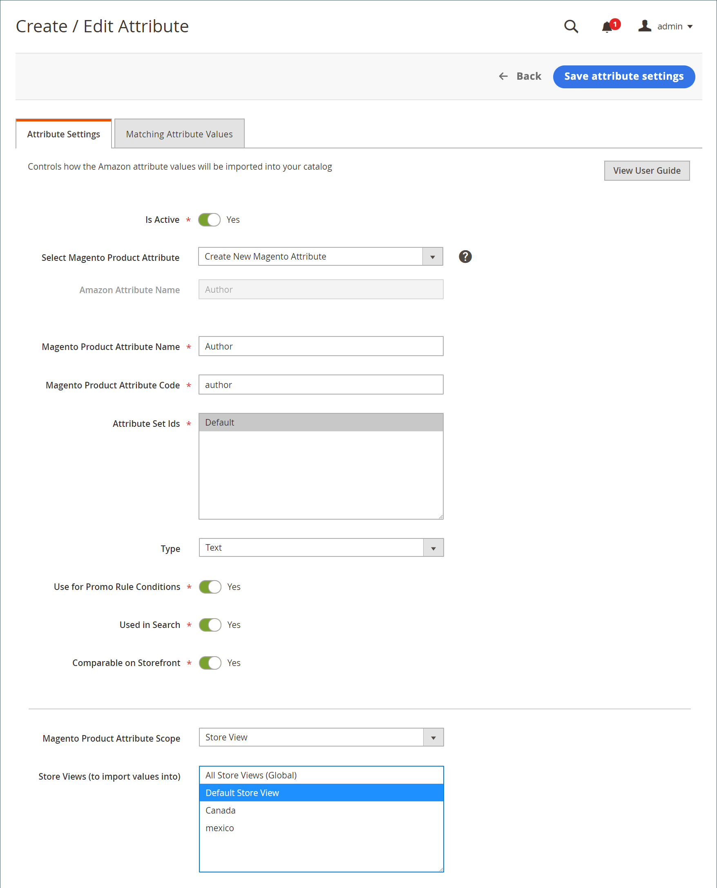

# Creare e modificare gli attributi

Crea o aggiorna [!DNL Commerce] Amazon e aggiorna i tuoi negozi. Esamina gli attributi Amazon correnti e i collegamenti [!DNL Commerce] attributi tramite [_[!UICONTROL Attributes]_visualizza](./attributes-view.md) della home page del canale di vendita Amazon. Il_[!UICONTROL Action]_ Nella colonna vengono visualizzate le azioni disponibili per l&#39;attributo. Puoi creare e mappare una nuova [!DNL Commerce] per un attributo Amazon non collegato, oppure puoi modificare un attributo esistente [!DNL Commerce] e il relativo mapping a un attributo Amazon.

Quando si creano e si aggiornano gli attributi, è possibile verificare i valori degli attributi per [!DNL Commerce] e prodotti Amazon. Questi valori possono essere diversi se non si sincronizzano e non si importano valori da Amazon. Per esaminare i valori di Amazon per questi attributi, consulta [Revisione della mappatura degli attributi di Amazon](./amazon-matching-attributes-values.md). Se desideri modificare questi valori, puoi: [modificare o creare una mappatura](./amazon-manually-update-incomplete-listing.md) tra Amazon e [!DNL Commerce].

## Creare un attributo {#create-an-attribute}

Questi passaggi creano un [!DNL Commerce] e mapparlo su un attributo Amazon. A seconda delle configurazioni, i valori possono iniziare la sincronizzazione tra i cataloghi.

1. Il giorno _Amministratore_ barra laterale, vai a **[!UICONTROL Marketing]** > _[!UICONTROL Channels]_>**[!UICONTROL Amazon Sales Channel]**.

1. Clic **[!UICONTROL Attributes]** nel menu a sinistra, individua un attributo di Amazon e fai clic su **[!UICONTROL Create Attribute]** nel _[!UICONTROL Action]_colonna.

1. Per abilitare la sincronizzazione dei valori di Amazon con il [!DNL Commerce] attributo, set **[!UICONTROL Is Active]** a `Yes`.

   Se impostato su `Yes`, i valori vengono sincronizzati in base alla configurazione.

1. Scegli `Create New Magento Attribute` per **[!UICONTROL Select Magento Product Attribute]**.

   L’attributo è mappato sul scelto per **[!UICONTROL Amazon Attribute Name]**.

1. Immetti un **[!UICONTROL Magento Product Attribute Name]**.

1. Immetti un **[!UICONTROL Magento Product Attribute Code]**.

   Questo valore deve essere tutto minuscolo senza spazi.

1. Per **[!UICONTROL Attribute Set Ids]**, scegliere una serie di attributi da assegnare.

   In genere, gli attributi fanno parte di un set di attributi, ad esempio un set per i colori con attributi blu, verde, giallo e rosso.

1. Per **[!UICONTROL Type]**, scegliere il tipo di valore dell&#39;attributo, ad esempio testo e numeri.

   Questa opzione influisce sul valore consentito per l’attributo.

1. Per **[!UICONTROL Use for Promo Rule Conditions]**, impostato su `Yes` per consentire la disponibilità dell&#39;attributo per un parametro nelle condizioni promozionali.

1. Per **[!UICONTROL Used in Search]**, impostato su `Yes` se l’attributo e il valore possono essere utilizzati nelle ricerche di prodotti.

1. Per **[!UICONTROL Comparable on Storefront]**, impostato su `Yes` se il valore dell’attributo può essere utilizzato nella funzionalità &quot;Confronta con&quot; di Amazon.

1. Scegli la [!DNL Commerce] [ambito](https://experienceleague.adobe.com/docs/commerce-admin/start/setup/websites-stores-views.html#scope-settings) per l’attributo, quindi seleziona una o più Viste archivio in cui importare i valori Amazon.

   Se l&#39;ambito è impostato su `Global`, il _[!UICONTROL Store View]_non può essere modificato dopo la creazione dell&#39;attributo.

   Se si sceglie `All Store Views (Global)`, sincronizza e salva i valori in tutte le visualizzazioni dello store di Amazon. Puoi sincronizzare i valori solo con specifiche visualizzazioni archivio.

1. Al termine, fai clic su **[!UICONTROL Save Attribute Settings]**.

Dopo il salvataggio, puoi modificare l’attributo per rivedere le impostazioni e le corrispondenze con Amazon e [!DNL Commerce] valori per l&#39;attributo. Puoi anche indicare se i valori di Amazon devono essere sovrascritti [!DNL Commerce] valori.

{width="600" zoomable="yes"}

| Campo | Descrizione |
|-----------------------------------------------------|-----------------------------------------------------------------------------------------------------------------------------------------------------------------------------------------------------------------------------------------------------------------------------------------------------------------------|
| [!UICONTROL Is Active] | Indica se questo attributo è attivo e sincronizza attivamente tra Amazon e [!DNL Commerce]. Imposta su `Yes` per garantire i valori degli attributi da Amazon e [!DNL Commerce] mantenere la sincronizzazione per l&#39;attributo selezionato. |
| Seleziona attributo prodotto Magento | Indica l’attributo selezionato che desideri collegare al Nome attributo di Amazon elencato. Quando crei un attributo, scegli `Create New Magento Attribute`. |
| [!UICONTROL Amazon Attribute Name] | Mostra il nome dell’attributo Amazon scelto. L’attributo selezionato è collegato a questo attributo di Amazon. Non è possibile modificare questo valore tramite [!DNL Commerce]. |
| [!UICONTROL Magento Product Attribute Name] | Indica il nome attributo o &quot;label&quot;. |
| [!UICONTROL Magento Product Attribute Code] | Indica il codice attributo, tutto in caratteri minuscoli senza spazi. |
| [!UICONTROL Attribute Set Ids] | Indica la serie di attributi a cui assegnare l&#39;attributo. Gli attributi tendono a far parte di un set di attributi, ad esempio un set per i colori con attributi per il blu, il verde, il giallo e il rosso. |
| [!UICONTROL Type] | Indica il tipo di valore del valore dell&#39;attributo, ad esempio testo e numeri. La selezione influisce sul valore consentito per l’attributo. |
| [!UICONTROL Use for Promo Rule Conditions] | Passa a `Yes` per consentire la disponibilità dell&#39;attributo per un parametro nelle condizioni promozionali. |
| [!UICONTROL Used in Search] | Indica se l’attributo e il valore possono essere utilizzati nelle ricerche di prodotti. |
| [!UICONTROL Comparable on Storefront] | Indica se il valore dell’attributo può essere utilizzato nella funzionalità &quot;Confronta per&quot; di Amazon. |
| [!UICONTROL Magento Product Attribute Scope] | Indica il [ambito](https://experienceleague.adobe.com/docs/commerce-admin/start/setup/websites-stores-views.html#scope-settings) per l’attributo. Opzioni: globale / vista store Se impostato su `Global`, non è possibile modificare la visualizzazione Store dopo la creazione dell&#39;attributo. |
| [!UICONTROL Store Views (to import values into to)] | Viene visualizzato solo se l&#39;ambito è impostato su `Store View`. Scegli la [visualizzazione store](https://experienceleague.adobe.com/docs/commerce-admin/start/setup/websites-stores-views.html) in cui vengono sincronizzati i valori degli attributi di Amazon. Scelta `All Store Views (Global)` aggiorna il valore in tutti [!DNL Commerce] visualizzazioni dello store. |

## Modificare un attributo {#edit-an-attribute}

1. Il giorno _Amministratore_ barra laterale, vai a **[!UICONTROL Marketing]** > _[!UICONTROL Channels]_>**[!UICONTROL Amazon Sales Channel]**.

1. Clic **[!UICONTROL Attributes]** nel menu a sinistra, individua un attributo di Amazon e fai clic su **[!UICONTROL Edit]** nel _[!UICONTROL Action]_colonna.

1. Per abilitare o disabilitare la sincronizzazione dei valori di Amazon con il [!DNL Commerce] attributo, set **È attivo** a `Yes` o `No`.

   Se impostato su `Yes`, i valori vengono sincronizzati in base alla configurazione.

1. Per **[!UICONTROL Select Magento Product Attribute]**, verifica o aggiorna l’attributo da mappare al scelto **[!UICONTROL Amazon Attribute Name]**.

1. Indica se desideri che il valore dell’attributo Amazon in entrata sovrascriva il valore dell’attributo esistente.

   Ad esempio, potrebbe non essere utile sovrascrivere i prezzi da Amazon in [!DNL Commerce].

   - **[!UICONTROL Do Not Overwrite Existing Magento Values]** - Mantiene il valore, mantenendo valori diversi per il [!DNL Commerce] e nei negozi Amazon.

   - **[!UICONTROL Overwrite Existing Magento Values]** : sovrascrive il valore in [!DNL Commerce] catalogo dei prodotti con il valore Amazon in entrata.

1. Se disponibile per la modifica, scegli uno o più **[!UICONTROL Store Views (to import Amazon values into)]**.

   Se l&#39;attributo è stato creato con un `Global` ambito, _Visualizzazione store_ non può essere modificato dopo la creazione dell&#39;attributo.

   Se si sceglie `All Store Views (Global)`, sincronizza e salva i valori in tutte le visualizzazioni del punto vendita. Puoi sincronizzare i valori solo con specifiche visualizzazioni archivio.

1. Al termine, fai clic su **[!UICONTROL Save Attribute Settings]**.

{width="600" zoomable="yes"}

| Campo | Descrizione |
|-----------------------------------------------------|----------------------------------------------------------------------------------------------------------------------------------------------------------------------------------------------------------------------------------------------------------------------------------------------------------------------------------------------------------------------------------------------------------------------------------------------------------------------------|
| [!UICONTROL Is Active] | Indica se questo attributo è attivo e sincronizza attivamente tra Amazon e [!DNL Commerce]. Imposta su `Yes` per garantire i valori degli attributi da Amazon e [!DNL Commerce] mantenere la sincronizzazione per l&#39;attributo selezionato. |
| [!UICONTROL Select Magento Product Attribute] | Indica la selezione [!DNL Commerce] che desideri collegare al Nome attributo di Amazon elencato. Se si desidera modificare il [!DNL Commerce] , scegliere un attributo diverso dall&#39;elenco a discesa. I valori vengono sincronizzati in base alle configurazioni. |
| [!UICONTROL Amazon Attribute Name] | Mostra il nome dell&#39;attributo Amazon come definito in [!DNL Amazon Seller Central]. Il valore selezionato [!DNL Commerce] collegamenti attributo a questo attributo Amazon. Non è possibile modificare questo valore tramite [!DNL Commerce]. |
| [!UICONTROL Overwrite Existing Value] | Indica se i valori dell’attributo Amazon sovrascrivono quelli esistenti [!DNL Commerce] valori, che interessano tutti i prodotti con questo [!DNL Commerce] attributo.<ul><li>**Non sovrascrivere i valori Magenti esistenti** - (Impostazione predefinita) Mantiene il [!DNL Commerce] valore, mantenendo valori diversi per [!DNL Commerce] e nei negozi Amazon.</li><li>**Sovrascrivi valori Magenti esistenti** - Salva il valore di Amazon nel [!DNL Commerce] valore in [!DNL Commerce] catalogo dei prodotti.</li></ul> |
| [!UICONTROL Magento Product Attribute Scope] | Non viene visualizzato quando si modifica un attributo se l&#39;attributo è stato creato con `Global` ambito. Indica che [!DNL Commerce] [ambito](https://experienceleague.adobe.com/docs/commerce-admin/start/setup/websites-stores-views.html#scope-settings) è stato creato e impostato su `Store View`. |
| [!UICONTROL Store Views (to import values into to)] | Scegli il tuo [!DNL Commerce] [visualizzazione store](https://experienceleague.adobe.com/docs/commerce-admin/start/setup/websites-stores-views.html) a cui sincronizzare i valori degli attributi di Amazon. Scelta `All Store Views (Global)` aggiorna il valore in tutte le visualizzazioni dello store. |
