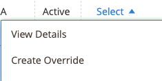

# Creare e modificare le sostituzioni

È possibile creare e sostituire un elenco oppure modificare o rimuovere un override applicato a un elenco. Le sostituzioni impostano un valore definito per un elenco specifico.

## Creare un override per un singolo elenco

La _[!UICONTROL Create Override]_è disponibile quando visualizzi gli elenchi nella_[!UICONTROL Inactive]_, _[!UICONTROL Active]_e_[!UICONTROL Ineligible]_ schede.

1. Visualizzare un elenco su un _[!UICONTROL Products Listings]_page (_[!UICONTROL Inactive]_, _[!UICONTROL Active]_e_[!UICONTROL Ineligible]_ ).

1. In _[!UICONTROL Action]_colonna, fai clic su **[!UICONTROL Select]**>**[!UICONTROL Create Override]**per aprire la pagina relativa alle sostituzioni dell’elenco dei prodotti .

   

1. Per verificare di aver visualizzato l’elenco corretto, verifica la _[!UICONTROL Listing Details]_.

1. Determinare il tipo di sostituzione che si sta creando.

   È possibile definire un singolo tipo di sostituzione o qualsiasi combinazione di tipi per l&#39;inserzione (prezzo, tempo di gestione, condizione, note sul venditore).

   - **Prezzo** - Clic **[!UICONTROL Change Listing Price]** e inserisci il valore del prezzo definito per **[!UICONTROL Price Override]**.
   - **Tempo di gestione** - Clic **[!UICONTROL Change Handling Time]** e immettere il valore temporale definito (in giorni) per **[!UICONTROL Handling Time Override]**.
   - **Condizione** - Clic **[!UICONTROL Change Condition]** e scegli l&#39;opzione corretta per il **[!UICONTROL Condition Override]**.
   - **Note sul venditore** - Clic **[!UICONTROL Change Seller Notes]** e inserire il testo delle note per **[!UICONTROL Seller Notes Override]**.

1. Clic **[!UICONTROL Save Listing Override]**.

   La _[!UICONTROL Product Listing Overrides]_la pagina si chiude. Lo stato dell’elenco cambia in `Relist in Progress`. La modifica verrà pubblicata in Amazon con la successiva sincronizzazione dati (come configurata nelle impostazioni cron). L’elenco viene aggiunto anche al_[!UICONTROL Overrides]_ scheda .

L&#39;esempio seguente mostra un override che definisce un nuovo prezzo di `$55`, un nuovo tempo di gestione `1 day`, una nuova condizione di `Used; Like New`, e nuovo testo di nota del venditore.

## Modificare o rimuovere una sostituzione per un singolo elenco {#edit-override-single-listing}

La _[!UICONTROL Edit Overrides]_è disponibile quando visualizzi gli elenchi nella_[!UICONTROL Overrides]_ scheda .

1. Visualizza un elenco _[!UICONTROL Product Listings]_page (_[!UICONTROL Overrides]_ ).

1. In _[!UICONTROL Action]_colonna, fai clic su **[!UICONTROL Select]**>**[!UICONTROL Edit Overrides]**.

   La _[!UICONTROL Product Listing Overrides]_viene visualizzata la pagina .

   

1. Per sovrascrivere l’elenco corretto, verifica la _[!UICONTROL Listing Details]_.

1. Per modificare il _[!UICONTROL Override]_definire le sezioni per il tipo da modificare (Prezzo, Tempo di gestione, Condizione, Note sul venditore).

   Per mantenere lo stesso tipo di sostituzione, selezionare `No Change To <override type>` (impostazione predefinita). Questa impostazione lascia invariato il valore di sostituzione precedentemente definito.

   - **Prezzo** - Clic **[!UICONTROL Change Listing Price]** e inserisci il valore del prezzo definito per **[!UICONTROL Price Override]**.
   - **Tempo di gestione** - Clic **[!UICONTROL Change Handling Time]** e immettere il valore temporale definito (in giorni) per **[!UICONTROL Handling Time Override]**.
   - **Condizione** - Clic **[!UICONTROL Change Condition]** e scegli l&#39;opzione corretta per **[!UICONTROL Condition Override]**.
   - **Note sul venditore** - Clic **[!UICONTROL Change Seller Notes]** e inserire il testo delle note per **[!UICONTROL Seller Notes Override]**.

1. Per rimuovere un tipo di sostituzione, fare clic su **Rimuovi** per ciascuno dei tipi da rimuovere. Se non viene rimosso, il valore definito in precedenza rimane nell&#39;override.

1. Clic **[!UICONTROL Save Listing Override]**.

   La _[!UICONTROL Product Listing Overrides]_la pagina si chiude. Lo stato dell’elenco cambia in `Relist in Progress`. La modifica verrà pubblicata in Amazon con la successiva sincronizzazione dati (come configurata nelle impostazioni cron). Se non è già elencato, gli elenchi vengono aggiunti anche al_[!UICONTROL Overrides]_ scheda .

Piggyback su _Creare un’override_ esempio. L&#39;esempio seguente mostra una modifica alla sostituzione creata in precedenza che definisce un nuovo prezzo di `$50`, rimuove l&#39;override del tempo di gestione e mantiene le sostituzioni precedenti di Condition e Seller Notes.

__

## Modificare o rimuovere un override per più elenchi {#edit-override-multiple-listings}

La _[!UICONTROL Edit Listing Overrides]_è disponibile nella sezione_[!UICONTROL Inactive]_, _[!UICONTROL Active]_,_[!UICONTROL Overrides]_ e _[!UICONTROL Ineligible]_schede.

>[!NOTE]
>
>Poiché modifichi le sostituzioni per più elenchi, la _[!UICONTROL Listing Details]_la sezione non viene visualizzata come quando si modifica un singolo elenco.

1. Visualizza l&#39;elenco su un _[!UICONTROL Products Listings]_page (_[!UICONTROL Inactive]_, _[!UICONTROL Active]_,_[!UICONTROL Overrides]_ e _[!UICONTROL Ineligible]_).

1. Seleziona la casella di controllo nella colonna a sinistra per ciascuno degli elenchi da modificare.

1. Sotto _[!UICONTROL Actions]_, fai clic su **[!UICONTROL Edit Listing Overrides]**.

   La _[!UICONTROL Product Listing Overrides]_viene visualizzata la pagina .

   

1. Per modificare il _[!UICONTROL Override]_definire le sezioni per il tipo da modificare (Prezzo, Tempo di gestione, Condizione, Note sul venditore).

   Per mantenere una sostituzione uguale, seleziona `No Change To <override type>` (predefinito). Questa impostazione lascia invariato il valore di sostituzione precedentemente definito.

   - **Prezzo** - Clic **[!UICONTROL Change Listing Price]** e inserisci il valore del prezzo definito per **[!UICONTROL Price Override]**.
   - **Tempo di gestione** - Clic **[!UICONTROL Change Handling Time]** e immettere il valore temporale definito (in giorni) per **[!UICONTROL Handling Time Override]**.
   - **Condizione** - Clic **[!UICONTROL Change Condition]** e scegli l&#39;opzione corretta per **[!UICONTROL Condition Override]**.
   - **Note sul venditore** - Clic **[!UICONTROL Change Seller Notes]** e inserire il testo delle note per **[!UICONTROL Seller Notes Override]**.

1. Per rimuovere un tipo di sostituzione, fare clic su **[!UICONTROL Remove]** per ciascuno dei tipi da rimuovere. Se non viene rimosso, il valore definito in precedenza rimane nell&#39;override.

1. Clic **[!UICONTROL Save Listing Override]**.

   La _[!UICONTROL Product Listing Overrides]_la pagina si chiude. Lo stato degli elenchi cambia in `Relist in Progress`. La modifica verrà pubblicata in Amazon con la successiva sincronizzazione dati (come configurata nelle impostazioni cron). Se non è già elencato, gli elenchi vengono aggiunti anche al_[!UICONTROL Overrides]_ scheda .

### Tipi di sostituzione

| Override | Descrizione |
|--- |--- |
| [!UICONTROL Price Override] | Una sostituzione del prezzo definisce il prezzo delle inserzioni. Questa sostituzione ha la priorità su tutte le impostazioni automatizzate fino a quando la sostituzione non viene rimossa.  Per ignorare il prezzo del prodotto, scegli **[!UICONTROL Change Listing Price]** e inserire il nuovo prezzo per **[!UICONTROL Price Override]**. |
| [!UICONTROL Handling Time Override] | Una sostituzione dei tempi di gestione definisce il tempo (in giorni) necessario per elaborare e spedire i prodotti. Una sostituzione del tempo di gestione ha la priorità su tutte le impostazioni di tempo di gestione automatizzata e predefinita fino a quando la sostituzione non viene rimossa.  Il valore presente nel _[!UICONTROL Handling Time Override]_è il tempo di gestione predefinito definito nel [elenco delle impostazioni](./listing-settings.md) o il tempo di gestione dell&#39;override definito. Se si rimuove una sostituzione del tempo di gestione, per impostazione predefinita l&#39;elenco riporta il tempo di gestione definito nelle impostazioni dell&#39;elenco.  Per definire una sostituzione del tempo di gestione, scegliere **[!UICONTROL Change Handling Time]**e inserire il nuovo tempo di movimentazione (in giorni) per **[!UICONTROL Handling Time Override]**. |
| [!UICONTROL Condition Override] | Per ignorare la condizione di elenco, scegli **[!UICONTROL Change Condition]** e scegliere la nuova condizione da **Override condizione**. |
| [!UICONTROL Seller Notes Override] | Per i prodotti del catalogo definiti con una condizione diversa da `New`, è possibile aggiungere una nota di vendita per fornire ulteriori dettagli sul prodotto e sulle sue condizioni ai potenziali acquirenti. È possibile inserire una sostituzione di una nota venditore per un `New` condiziona il prodotto, ma Amazon non visualizza la nota.  Per ignorare le note del venditore, scegli **[!UICONTROL Change Seller Notes]** e inserire la nuova nota per **[!UICONTROL Seller Notes Override]**. |
