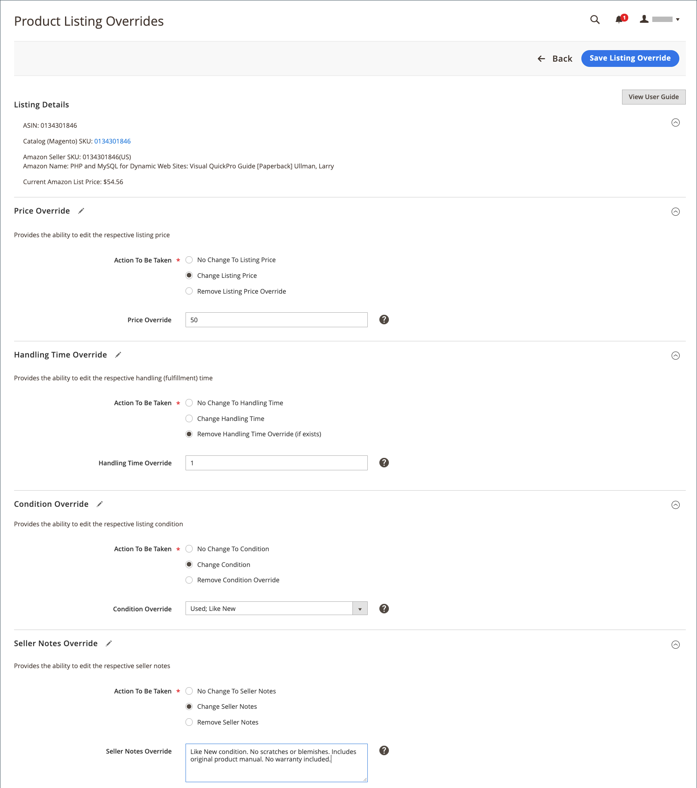

# Creare e modificare le sostituzioni

È possibile creare e sostituire un&#39;inserzione oppure modificare o rimuovere un&#39;esclusione applicata a un&#39;inserzione. Sostituisce imposta un valore definito per un elenco specifico.

## Creare una sostituzione per una singola inserzione

Il _[!UICONTROL Create Override]_azione è disponibile quando si visualizzano le inserzioni sul_[!UICONTROL Inactive]_, _[!UICONTROL Active]_, e_[!UICONTROL Ineligible]_ schede.

1. Visualizzare un’inserzione su una _[!UICONTROL Products Listings]_page (_[!UICONTROL Inactive]_, _[!UICONTROL Active]_, e_[!UICONTROL Ineligible]_ ).

1. In _[!UICONTROL Action]_, fare clic su **[!UICONTROL Select]**>**[!UICONTROL Create Override]**per aprire la pagina Sostituzioni elenco prodotti.

   {width="220"}

1. Per essere certi di visualizzare l’inserzione corretta, verifica che _[!UICONTROL Listing Details]_.

1. Determinare il tipo di sostituzione che si sta creando.

   Puoi definire un singolo tipo di sostituzione o qualsiasi combinazione di tipi per l’inserzione (prezzo, tempo di gestione, condizione, note del venditore).

   - **Prezzo** - Clic **[!UICONTROL Change Listing Price]** e inserire il valore del prezzo definito per **[!UICONTROL Price Override]**.
   - **Tempo di imballaggio** - Clic **[!UICONTROL Change Handling Time]** e inserisci il valore di tempo definito (in giorni) per **[!UICONTROL Handling Time Override]**.
   - **Condizione** - Clic **[!UICONTROL Change Condition]** e scegli l’opzione corretta per **[!UICONTROL Condition Override]**.
   - **Note del venditore** - Clic **[!UICONTROL Change Seller Notes]** e immettere il testo delle note per **[!UICONTROL Seller Notes Override]**.

1. Clic **[!UICONTROL Save Listing Override]**.

   Il _[!UICONTROL Product Listing Overrides]_la pagina si chiude. Lo stato dell’inserzione cambia in `Relist in Progress`. La modifica verrà pubblicata in Amazon con la prossima sincronizzazione dati (come configurato nelle impostazioni cron). L’inserzione viene aggiunta anche al_[!UICONTROL Overrides]_ scheda.

L&#39;esempio seguente mostra una sostituzione che definisce un nuovo prezzo di `$55`, un nuovo tempo di imballaggio di `1 day`, una nuova condizione di `Used; Like New`e il nuovo testo della Nota del venditore.

{width="600" zoomable="yes"}

## Modificare o rimuovere una sostituzione per una singola inserzione {#edit-override-single-listing}

Il _[!UICONTROL Edit Overrides]_azione è disponibile quando si visualizzano le inserzioni sul_[!UICONTROL Overrides]_ scheda.

1. Visualizzare un’inserzione su _[!UICONTROL Product Listings]_page (_[!UICONTROL Overrides]_ ).

1. In _[!UICONTROL Action]_, fare clic su **[!UICONTROL Select]**>**[!UICONTROL Edit Overrides]**.

   Il _[!UICONTROL Product Listing Overrides]_viene visualizzata la pagina.

   {width="125"}

1. Per assicurarti di sovrascrivere l’inserzione corretta, verifica _[!UICONTROL Listing Details]_.

1. Per modificare _[!UICONTROL Override]_, definire le sezioni per il tipo che si desidera modificare (Prezzo, Tempo di imballaggio, Condizione, Note del venditore).

   Per mantenere lo stesso tipo di sostituzione, seleziona `No Change To <override type>` (impostazione predefinita). Questa impostazione lascia invariato il valore di sostituzione definito in precedenza.

   - **Prezzo** - Clic **[!UICONTROL Change Listing Price]** e inserire il valore del prezzo definito per **[!UICONTROL Price Override]**.
   - **Tempo di imballaggio** - Clic **[!UICONTROL Change Handling Time]** e inserisci il valore di tempo definito (in giorni) per **[!UICONTROL Handling Time Override]**.
   - **Condizione** - Clic **[!UICONTROL Change Condition]** e scegli l’opzione corretta per **[!UICONTROL Condition Override]**.
   - **Note del venditore** - Clic **[!UICONTROL Change Seller Notes]** e immettere il testo delle note per **[!UICONTROL Seller Notes Override]**.

1. Per rimuovere un tipo di sostituzione, fare clic su **Rimuovi** per ciascuno dei tipi che si desidera rimuovere. Se non viene rimosso, il valore definito in precedenza rimane nell&#39;override.

1. Clic **[!UICONTROL Save Listing Override]**.

   Il _[!UICONTROL Product Listing Overrides]_la pagina si chiude. Lo stato dell’inserzione cambia in `Relist in Progress`. La modifica verrà pubblicata in Amazon con la prossima sincronizzazione dati (come configurato nelle impostazioni cron). Se non sono già presenti nell&#39;elenco, le inserzioni verranno aggiunte anche al_[!UICONTROL Overrides]_ scheda.

Piggyback sul _Creare una sostituzione_ esempio. L&#39;esempio seguente mostra una modifica alla sostituzione creata in precedenza che definisce un nuovo prezzo di `$50`, rimuove la sostituzione del tempo di gestione e mantiene le sostituzioni precedenti di Condizione e Note del venditore.

{width="600" zoomable="yes"}
__

## Modifica o rimuovi una sostituzione per più inserzioni {#edit-override-multiple-listings}

Il _[!UICONTROL Edit Listing Overrides]_è disponibile sul_[!UICONTROL Inactive]_, _[!UICONTROL Active]_,_[!UICONTROL Overrides]_, e _[!UICONTROL Ineligible]_schede.

>[!NOTE]
>
>Poiché stai modificando le sostituzioni per più inserzioni, il _[!UICONTROL Listing Details]_La sezione non viene visualizzata come quando si modifica una singola voce.

1. Visualizza l’inserzione su _[!UICONTROL Products Listings]_page (_[!UICONTROL Inactive]_, _[!UICONTROL Active]_,_[!UICONTROL Overrides]_, e _[!UICONTROL Ineligible]_).

1. Seleziona la casella di controllo nella colonna a sinistra per ciascuna delle inserzioni che desideri modificare.

1. Sotto _[!UICONTROL Actions]_, fai clic su **[!UICONTROL Edit Listing Overrides]**.

   Il _[!UICONTROL Product Listing Overrides]_viene visualizzata la pagina.

   {width="200"}

1. Per modificare _[!UICONTROL Override]_, definire le sezioni per il tipo che si desidera modificare (Prezzo, Tempo di imballaggio, Condizione, Note del venditore).

   Per mantenere invariata una sostituzione, seleziona `No Change To <override type>` (impostazione predefinita). Questa impostazione lascia invariato il valore di sostituzione definito in precedenza.

   - **Prezzo** - Clic **[!UICONTROL Change Listing Price]** e inserire il valore del prezzo definito per **[!UICONTROL Price Override]**.
   - **Tempo di imballaggio** - Clic **[!UICONTROL Change Handling Time]** e inserisci il valore di tempo definito (in giorni) per **[!UICONTROL Handling Time Override]**.
   - **Condizione** - Clic **[!UICONTROL Change Condition]** e scegli l’opzione corretta per **[!UICONTROL Condition Override]**.
   - **Note del venditore** - Clic **[!UICONTROL Change Seller Notes]** e immettere il testo delle note per **[!UICONTROL Seller Notes Override]**.

1. Per rimuovere un tipo di sostituzione, fare clic su **[!UICONTROL Remove]** per ciascuno dei tipi che si desidera rimuovere. Se non viene rimosso, il valore definito in precedenza rimane nell&#39;override.

1. Clic **[!UICONTROL Save Listing Override]**.

   Il _[!UICONTROL Product Listing Overrides]_la pagina si chiude. Lo stato delle inserzioni diventa `Relist in Progress`. La modifica verrà pubblicata in Amazon con la prossima sincronizzazione dati (come configurato nelle impostazioni cron). Se non sono già presenti nell&#39;elenco, le inserzioni verranno aggiunte anche al_[!UICONTROL Overrides]_ scheda.

### Sostituisci tipi

| Ignora | Descrizione |
|--- |--- |
| [!UICONTROL Price Override] | Una sostituzione prezzo definisce il prezzo per le inserzioni. Questa sostituzione ha la priorità su tutte le impostazioni automatizzate fino a quando non viene rimossa.  Per modificare il prezzo del prodotto, scegliere **[!UICONTROL Change Listing Price]** e inserisci il nuovo prezzo per **[!UICONTROL Price Override]**. |
| [!UICONTROL Handling Time Override] | Una sostituzione del tempo di gestione definisce il tempo necessario (in giorni) per elaborare e spedire i prodotti. Una sostituzione del tempo di gestione ha la priorità su tutte le impostazioni automatizzate e predefinite del tempo di gestione fino a quando la sostituzione non viene rimossa.  Il valore esistente in _[!UICONTROL Handling Time Override]_è il tempo di imballaggio predefinito definito nel [impostazioni elenco](./listing-settings.md) o il tempo di gestione dell&#39;override definito. Se si rimuove una sostituzione del tempo di gestione, per impostazione predefinita viene utilizzato il tempo di gestione definito nelle impostazioni dell&#39;inserzione.  Per definire una sostituzione del tempo di gestione, scegliere **[!UICONTROL Change Handling Time]**e immettere il nuovo tempo di imballaggio (in giorni) per **[!UICONTROL Handling Time Override]**. |
| [!UICONTROL Condition Override] | Per ignorare la condizione dell&#39;elenco, scegliere **[!UICONTROL Change Condition]** e scegli la nuova condizione da **Sostituzione condizione**. |
| [!UICONTROL Seller Notes Override] | Per i prodotti del catalogo definiti con una condizione diversa da `New`, puoi aggiungere una nota del venditore per descrivere più dettagliatamente il tuo prodotto e le sue condizioni ai potenziali acquirenti. È possibile inserire una sostituzione nota del venditore per un `New` condizione, ma Amazon non visualizza la nota.  Per ignorare le note del venditore, scegli **[!UICONTROL Change Seller Notes]** e inserisci la nuova nota per **[!UICONTROL Seller Notes Override]**. |
