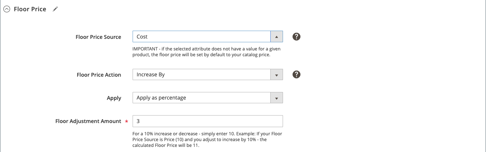

# Regola di tariffazione intelligente: prezzo base

Le sezioni di una regola di rideterminazione dei prezzi intelligente includono:

- [[!UICONTROL Select Rule Type]](./intelligent-repricing-rules.md)
- [[!UICONTROL Competitor Conditional Variances]](./competitor-conditional-variances.md)
- [[!UICONTROL Price Adjustment]](./price-adjustment.md)
- [!UICONTROL Floor Price]
- [[!UICONTROL Optional Ceiling Price]](./optional-ceiling-price.md)

Il [prezzo base](./floor-price.md) le impostazioni proteggono automaticamente il prezzo più basso del prodotto dalle regole di prezzo intelligenti. Utilizza queste impostazioni per impostare un prezzo minimo per le tue regole di prezzo intelligenti, assicurandoti che i tuoi prodotti non siano elencati al di sotto di un prezzo desiderato.

Gli attributi del prezzo base si basano sull&#39;ambito del sito Web se [!DNL Commerce] lo store sta utilizzando l&#39;ambito di determinazione prezzi del sito Web. Consulta [Limite prezzo](./price-scope.md).

Il prezzo minimo viene utilizzato solo quando **[!UICONTROL Rule Type]** è impostato su `Intelligent repricing rule`.

## Configura prezzo minimo

Definisci l’impostazione del prezzo più basso in _[!UICONTROL Floor Price]_sezione.

1. Per **[!UICONTROL Floor Price Source]**, scegliere un attributo origine prezzo.

   Scegli la [!DNL Commerce] [attributo prodotto](https://experienceleague.adobe.com/docs/commerce-admin/catalog/product-attributes/product-attributes.html) che indica il limite del pavimento relativo. Ad esempio, se non vuoi che il prezzo dell&#39;inserzione Amazon scenda sotto il costo dell&#39;oggetto, scegli il *Costo* attributo.

1. Per **[!UICONTROL Floor Price Action]**, scegli un’opzione.

   - `Decrease By` - Scegli quando vuoi definire _[!UICONTROL Floor Price Source]_valore da regolare verso il basso, creando un prezzo minimo inferiore per la regola, prima di mettere in vendita ad Amazon.

   - `Increase By` - Scegli quando vuoi definire _[!UICONTROL Floor Price Source]_valore da adeguare, creando un prezzo base più alto per la regola, prima di inserirlo nell’elenco di Amazon.

   - `Match` - Scegliere quando non si desidera che il prezzo di vendita fluttui al di sotto del _[!UICONTROL Floor Price Source]_valore. Se impostato su `Match`, il_[!UICONTROL Apply]_ e _[!UICONTROL Floor Adjustment Amount]_campi sono disattivati.

1. Lascia **[!UICONTROL Apply]** predefinito come `Apply as percentage`.

1. Per **[!UICONTROL Floor Adjustment Price]**, immettere il valore numerico per la percentuale di adeguamento _[!UICONTROL Floor Price Source]_valore.

In questo esempio, il prezzo minimo è impostato per essere superiore del 3% al costo dell&#39;articolo.

{width="600" zoomable="yes"}

| Campo | Descrizione |
|--- |--- |
| [!UICONTROL Floor Price Source] | Scegli la [!DNL Commerce] attributo che indica il limite minimo relativo (prezzo più basso). Ad esempio, se non vuoi che il prezzo dell&#39;inserzione Amazon scenda sotto il costo dell&#39;oggetto, scegli il `Cost` attributo. |
| [!UICONTROL Floor Price Action] | Scegliere un&#39;azione di adeguamento della determinazione prezzi. Opzioni:<ul><li>**[!UICONTROL Decrease By]** - Scegli quando vuoi definire _[!UICONTROL Floor Price Source]_valore da regolare verso il basso, creando un prezzo minimo inferiore per la regola, prima di mettere in vendita ad Amazon.</li><li>**[!UICONTROL Increase By]** - Scegli quando vuoi definire _[!UICONTROL Floor Price Source]_valore da adeguare, creando un prezzo base più alto per la regola, prima di inserirlo nell’elenco di Amazon.</li><li>**[!UICONTROL Match]** - Scegliere quando non si desidera che il prezzo di vendita fluttui al di sotto del _[!UICONTROL Floor Price Source]_valore. Quando viene scelto, il_[!UICONTROL Apply]_ e _[!UICONTROL Floor Adjustment Amount]_campi sono disattivati.</li></ul> |
| [!UICONTROL Apply] | **[!UICONTROL Apply as percentage]** - Un adeguamento percentuale relativo al _[!UICONTROL Floor Price Source]_valore. |
| [!UICONTROL Floor Adjustment Amount] | Immettere il valore numerico per la percentuale di adeguamento _[!UICONTROL Floor Price Source]_valore. |
