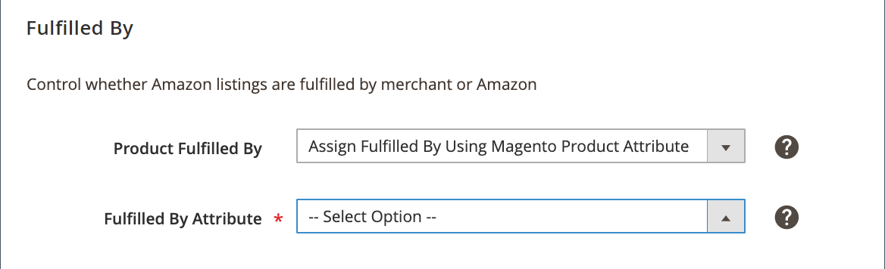

# Completato da

_[!UICONTROL Fulfilled By]_Le impostazioni fanno parte delle impostazioni di elenco degli archivi. Le impostazioni dell’elenco sono accessibili dal [dashboard store](./amazon-store-dashboard.md).

Queste impostazioni definiscono la parte che soddisfa (o spedisce) gli ordini. Se tutti i tuoi ordini vengono eseguiti utilizzando un metodo, scegli tra esercente (tu) o Amazon. Se prevedi di eseguire ordini dalle posizioni e di utilizzare Amazon, è consigliabile utilizzare la terza opzione e configurare un [!DNL Commerce] attributo di prodotto.

- **[!UICONTROL Fulfilled by Merchant]** - Scegli se tu, il commerciante, esegui tutti gli ordini. Quando viene effettuato un ordine, l&#39;inventario viene detratto dal tuo [!DNL Commerce] catalogo.

- **[!UICONTROL Fulfilled by Amazon]** - Scegli se Amazon soddisfa tutti gli ordini. Con questa opzione, l’inventario dei prodotti non viene detratto dal tuo [!DNL Commerce] catalogo quando viene effettuato un ordine. Le scorte di magazzino per gli ordini evasi di Amazon vengono archiviate e detratte dai rispettivi magazzini. Prima di assegnare questa opzione, devi verificare nella [!DNL Amazon Seller Central] i prodotti sono idonei per _Eseguito Da Amazon_ (FBA) adempimento. L’inventario FBA viene gestito direttamente tramite la [!DNL Amazon Seller Central] Conto. Con questo metodo di evasione, il canale di vendita Amazon non condivide gli aggiornamenti di quantità tra [!DNL Commerce] e Amazon. Pertanto, non tutti gli strumenti di marketing descritti in Impostazioni quantità sono disponibili nel canale di vendita Amazon.

- **[!UICONTROL Assign Fulfilled By Using Magento Product Attribute]** - Se i tuoi prodotti possono essere soddisfatti da te e da Amazon, puoi creare un [!DNL Commerce] attributo di prodotto con i valori per Fulfill By Merchant e Fulfill by Amazon. L&#39;impostazione di questo valore per prodotto indica chi soddisfa gli ordini.

Il metodo di adempimento è un attributo regionale e si basa sul **[!UICONTROL Amazon Marketplace Country]** impostazione definita durante [integrazione store](./store-integration.md). Quando viene apportata una modifica, questa influisce su tutti gli elenchi di Amazon che condividono tale [!DNL Amazon Seller SKU] nei negozi Amazon che vendono nella stessa regione (come definito in _[!UICONTROL Amazon Marketplace Country]_durante [integrazione store](./store-integration.md)). Una modifica a una condivisione [!DNL Amazon Seller SKU] negli Stati Uniti non influisce sugli archivi Amazon impostati per un&#39;area diversa (come definito durante l&#39;integrazione dello store).

>[!NOTE]
>
>Quando un ordine viene soddisfatto da Amazon (FBA) e l’ordine viene importato, nei dettagli dell’ordine puoi visualizzare dati fittizi per alcuni campi. Vedi [Dettagli ordine Amazon](./amazon-order-details.md).

## Configura le [!UICONTROL Fulfilled By] impostazioni {#configure-fulfilled-by-settings}

1. Fai clic su **[!UICONTROL Listing Settings]** sul dashboard dello store.

1. Espandi la _[!UICONTROL Fulfilled By]_sezione .

1. Per **[!UICONTROL Product Fulfilled By]**, scegliere chi soddisfa (navi) l&#39;ordine:

   - `Fulfilled by Merchant` - Il commerciante adempie l&#39;ordine.

   - `Fulfilled by Amazon` - Il magazzino Amazon soddisfa l&#39;ordine.

   - `Assign Fulfilled By Using Magento Product Attribute` - A [!DNL Commerce] attributo indica chi soddisfa l&#39;ordine per prodotto.

      Se scelto, scegli la [!DNL Commerce] attributo da mappare in **[!UICONTROL Fulfilled by Attribute]**.

1. Al termine, fai clic su **[!UICONTROL Save listing settings]**.

| Campo | Descrizione |
|--- |--- |
| [!UICONTROL Product Fulfilled By] | Opzioni:<ul><li>**[!UICONTROL Fulfilled by Merchant]** - (FBM) Scegli se esegui gli ordini. Quando viene effettuato un ordine, l&#39;inventario viene detratto dal tuo [!DNL Commerce] catalogo. Quando viene creato un nuovo prodotto, viene assegnato il metodo di esecuzione di Merchant Fulfill.</li><li>**[!UICONTROL Fulfilled by Amazon]** - (FBA) Scegli se Amazon soddisfa gli ordini. Con questo metodo di evasione, l&#39;inventario dei prodotti non viene detratto dal tuo [!DNL Commerce] catalogo quando viene effettuato un ordine. Quando un prodotto viene creato, viene creato con _[!UICONTROL Fulfilled by Amazon (FBA)]_come tipo di evasione. Assicurati che i tuoi prodotti siano idonei per la realizzazione FBA all&#39;interno del tuo [!DNL Amazon Seller Central] conto. L’inventario FBA viene gestito direttamente anche tramite la [!DNL Amazon Seller Central] conto. Con questo metodo di evasione, gli aggiornamenti di quantità non vengono inviati rispetto al tuo [!DNL Commerce] , per cui non puoi utilizzare alcuni degli strumenti di marketing descritti in [Impostazioni stock/quantità](./stock-quantity.md).</li><li>**[!UICONTROL Assign Fulfilled By Using Magento Product Attribute]** - Scegliere se si dispone di un [!DNL Commerce] attributo che determina se è soddisfatto dal commerciante o soddisfatto da Amazon. Se scelto, **[!UICONTROL Fulfilled by Attribute]** abilita.</li></ul> |
| [!UICONTROL Fulfilled By Attribute] | Scegli la [!DNL Commerce] attributo utilizzato per determinare il metodo di evasione.  Ad esempio, se l’attributo è _Completato da_ e si sceglie il valore dell&#39;attributo come _[!UICONTROL Fulfilled By Merchant]_o_[!UICONTROL Fulfilled By Amazon (FBA)]_, il sistema utilizza tale valore come tipo di evasione per un nuovo prodotto. In qualità di commerciante, devi assicurarti che i tuoi prodotti siano idonei per la realizzazione FBA all&#39;interno del tuo [!DNL Amazon Seller Central] conto. L&#39;inventario FBA viene gestito direttamente anche tramite il tuo account Amazon Seller.  Le opzioni dipendono dagli attributi impostati per i prodotti Amazon. |

**Accesso rapido** - [!UICONTROL Listing Settings] sezioni

- [[!UICONTROL Product Listing Actions]](./product-listing-actions.md)
- [[!UICONTROL Third Party Listings]](./third-party-listing-settings.md)
- [[!UICONTROL Listing Price]](./listing-price.md)
- [[!UICONTROL (B2B) Business Price]](./business-pricing.md)
- [[!UICONTROL Stock / Quantity]](./stock-quantity.md)
- [[!UICONTROL Fulfilled By]](./fulfilled-by.md)
- [[!UICONTROL Catalog Search]](./catalog-search.md)
- [[!UICONTROL Product Listing Condition]](./product-listing-condition.md)
