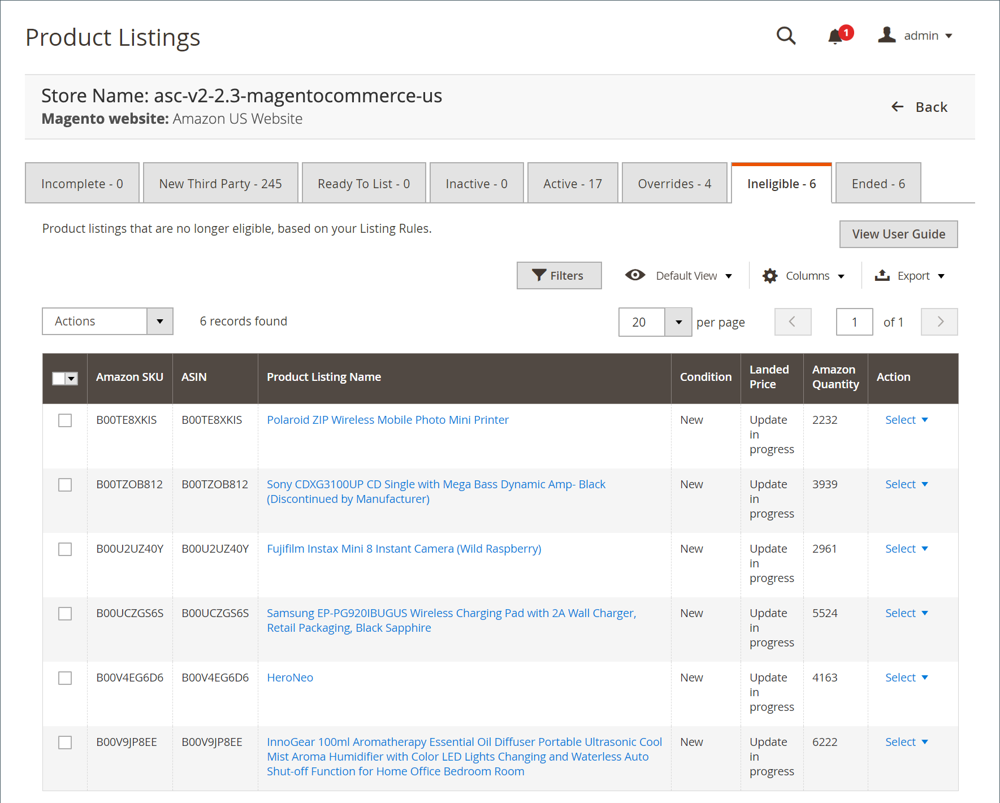

# Inserzioni non ammissibili

Il _[!UICONTROL Ineligible]_La scheda mostra un elenco di tutti i prodotti attualmente pubblicati su Amazon ma che non sono idonei come inserzione in base alle regole di inserzione correnti. Se un prodotto precedente era idoneo e le regole di inserzione vengono modificate in modo da renderlo non idoneo, la quantità associata a un prodotto scende a 0 e il prodotto viene contrassegnato come_ non idoneo _. Tuttavia, è ancora presente nel tuo [!DNL Amazon Seller Account].

Per spostare un prodotto fuori dal _[!UICONTROL Ineligible]_, è possibile [modifica le regole di inserzione](./listing-rules.md) per rendere idonei i tuoi prodotti.

Le azioni disponibili sul _[!UICONTROL Ineligible]_La scheda include:

Sotto _[!UICONTROL Actions]_:

- **[!UICONTROL End Listing(s) on Amazon]**: scegli di rimuovere tutte le inserzioni selezionate da [!DNL Amazon Marketplace]. Consulta [Terminare un’inserzione in Amazon](./end-listings-manually.md).

- **[!UICONTROL Edit Listing Overrides]**: scegli di modificare le impostazioni di sostituzione per l’inserzione. Consulta [Sostituzioni](./overrides.md) o [Modificare o rimuovere una sostituzione](./creating-editing-overrides.md#edit-override-single-listing).

Sotto **[!UICONTROL Select]** nel _[!UICONTROL Action]_colonna:

- **[!UICONTROL View Details]**: scegli di visualizzare i dettagli dell’inserzione, tra cui [Elenco registro attività](./product-listing-details.md#listing-activity-log), [Prezzi dei concorrenti Buy Box](./product-listing-details.md#buy-box-competitor-pricing), e [Prezzi più bassi per i concorrenti](./product-listing-details.md#lowest-competitor-pricing). Questa azione è solo per la visualizzazione. Non è possibile apportare modifiche ai dettagli dell&#39;inserzione. Consulta [Visualizza dettagli](./product-listing-details.md).

- **[!UICONTROL Create Override]**: scegli di creare una sostituzione e applicarla a questa inserzione. Consulta [Creare una sostituzione](./creating-editing-overrides.md).

- **[!UICONTROL Edit Assigned ASIN]**: scegli di modificare il codice ASIN assegnato al prodotto catalogo. Questa azione viene utilizzata se un prodotto nel catalogo ha restituito un codice ASIN errato. Consulta [Modifica un ASIN assegnato](./edit-assigned-asin.md).

- **[!UICONTROL Create Alias Seller SKU]**: scegli di creare uno SKU alias da utilizzare per creare un’inserzione Amazon dallo stesso prodotto di catalogo. Consulta [Crea un SKU del venditore di alias](./create-alias-seller-sku.md).

- **[!UICONTROL Switch to Fulfilled by Amazon/Merchant]**: scegliere di modificare il metodo di evasione associato all&#39;ordine. Consulta [Configurare le impostazioni di Evasione per](./fulfilled-by.md#configure-fulfilled-by-settings).

- **[!UICONTROL End Listing]**: scegli di rimuovere l’inserzione dal [!DNL Amazon Marketplace]. Consulta [Terminare un’inserzione in Amazon](./end-listings-manually.md).

>[!NOTE]
>Se sono presenti inserzioni in corso, il numero di inserzioni viene visualizzato in un messaggio sopra le schede.

Le home page del canale di vendita Amazon hanno alcuni punti in comune [controlli workspace](./workspace-controls.md) che ti consentono di personalizzare i dati visualizzati.

## Colonne predefinite

| Colonna | Descrizione |
|--- |--- |
| [!UICONTROL Amazon Seller SKU] | Lo SKU (Stock Keeping Unit) assegnato da Amazon a un prodotto per identificare il prodotto, le opzioni, il prezzo e il produttore. |
| [!UICONTROL ASIN] | Un blocco univoco di 10 lettere e/o numeri che identificano gli elementi.  ASIN è l&#39;acronimo di [!DNL Amazon Standard Identification Number]. Un codice ASIN è un blocco univoco di 10 lettere e/o numeri che identificano gli elementi. Per i libri, il codice ASIN è uguale al numero ISBN, ma per tutti gli altri prodotti viene creato un nuovo codice ASIN al momento del caricamento dell&#39;elemento nel catalogo. Puoi trovare un codice ASIN nella pagina dei dettagli del prodotto di Amazon, insieme a ulteriori dettagli relativi all’elemento. |
| [!UICONTROL Product Listing Name] | Il nome del prodotto. |
| [!UICONTROL Condition] | Il [condizione](./product-listing-condition.md) del prodotto. |
| [!UICONTROL Landed Price] | Il prezzo di listino del prodotto più il prezzo di spedizione. |
| [!UICONTROL Amazon Quantity] | Quantità disponibile quando il prodotto è inserito nell’elenco attivo di Amazon. |
| [!UICONTROL Action] | Elenco delle azioni disponibili che possono essere applicate a un elenco specifico. Per applicare un’azione, fai clic su **[!UICONTROL Select]** nel _[!UICONTROL Action]_e selezionare un&#39;opzione:<ul><li>[[!UICONTROL View Details]](./product-listing-details.md)</li><li>[Crea sostituzione](./creating-editing-overrides.md)</li><li>[[!UICONTROL Edit Assigned ASIN]](./edit-assigned-asin.md)</li><li>[[!UICONTROL Create Alias Seller SKU]](./create-alias-seller-sku.md#region-specific)</li><li>[[!UICONTROL Switch to Fulfilled By Amazon/Merchant]](./fulfilled-by.md#configure-fulfilled-by-settings)</li><li>[[!UICONTROL End Listing]](./end-listings-manually.md)</li></ul> |
