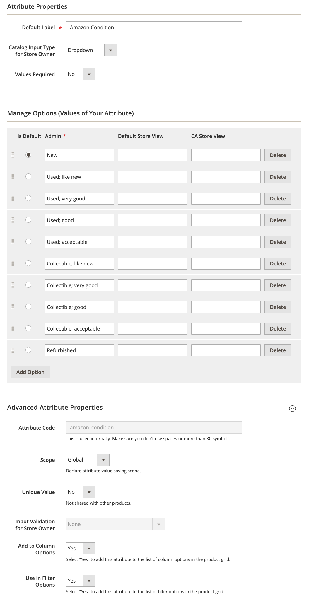

# Crea [!DNL Commerce] Attributi per Amazon

Prima dell’onboarding del [!DNL Amazon Seller Central] account, è consigliabile aggiungere [!DNL Commerce] [attributi del prodotto](https://docs.magento.com/user-guide/stores/attributes-product.html){target=&quot;_blank&quot;} per mappare gli elenchi dei prodotti. Dopo aver completato l’onboarding, puoi gestire gli attributi del prodotto tramite [Attributi](./managing-attributes.md) della scheda [Pagina principale del canale di vendita Amazon](./amazon-sales-channel-home.md) pagina.

Queste istruzioni spiegano come creare [!DNL Commerce] Attributi per Amazon ASIN e Amazon Condition. Si consiglia di creare attributi aggiuntivi tra cui Amazon EAN, Amazon ISBN e Amazon UPC. Puoi anche creare un attributo del prezzo di Amazon se desideri utilizzare il prezzo di listino di Amazon come origine del prezzo per le regole di prezzo. Questi attributi vengono utilizzati per configurare le impostazioni di quotazione e di quotazione durante l’onboarding. Utilizza anche questi attributi durante la creazione di elenchi Amazon e durante l’aggiornamento e la sincronizzazione dei [!DNL Commerce] catalogo con le inserzioni Amazon.

Le impostazioni di Ricerca nel catalogo consentono di impostare i parametri di ricerca corrispondenti che consentono di mappare quelli idonei [!DNL Commerce] prodotti con elenchi Amazon. Quando viene mappata, Amazon attiva azioni relative a prezzi, quantità, sostituzioni e sincronizzazione di ordini e prodotti.

La definizione di questi valori aumenta il potenziale di corrispondenze esatte, riducendo al minimo la necessità di abbinare manualmente gli elenchi di prodotti in un secondo momento. Aggiunta di attributi come parte dell’onboarding [attività pre-installazione](./amazon-pre-setup-tasks.md), il canale di vendita Amazon ha un potenziale più elevato per abbinare automaticamente i prodotti durante l&#39;onboarding e la sincronizzazione dei dati dei prodotti tra Amazon e [!DNL Commerce] dopo l&#39;onboarding.

Se crei solo l’attributo Amazon ASIN (senza aggiungere valori ASIN per prodotto), il tuo [!DNL Commerce] i prodotti potrebbero non corrispondere automaticamente agli elenchi di Amazon. Puoi abbinare manualmente i tuoi prodotti attraverso _Revisione del negozio_. Tuttavia, la corrispondenza manuale non crea gli elementi dati necessari per condividere e sincronizzare i dati del prodotto.

>[!IMPORTANT]
>
>Se aggiorni un elemento dati ASIN, UPC o di altro tipo per un prodotto corrispondente manualmente, devi aggiornare i dati in entrambe le posizioni: le [!DNL Commerce] catalogo e inserzione nella [!DNL Amazon Seller Central] conto.

## Creare l’attributo di prodotto Amazon ASIN

1. Accedi al tuo [!DNL Commerce] Amministratore.

1. Fai clic su **[!UICONTROL Stores]** nel menu a sinistra.

1. In _[!UICONTROL Attributes]_sezione, fai clic su **[!UICONTROL Product]**.

1. Per aprire le proprietà degli attributi, fai clic su **[!UICONTROL Add New Attribute]**.

1. Per **[!UICONTROL Default Label]**, inserisci `Amazon ASIN` (il nome dell&#39;attributo).

1. Per **[!UICONTROL Catalog Input Type for Store Owner]**, scegli `Text Field`.

1. Per **[!UICONTROL Values Required]**, scegli `No`.

   Sebbene sia necessario un Amazon ASIN per elencare un prodotto su Amazon, alcuni dei prodotti di catalogo potrebbero non essere elencati su Amazon.

1. Espandi la _[!UICONTROL Advanced Attribute Properties]_e imposta le opzioni:

   - Per **[!UICONTROL Attribute Code]**, inserisci `amazon_asin`.

   - Per **[!UICONTROL Scope]**, scegli `Global`.

   - Per **[!UICONTROL Unique Value]**, scegli `No`.

   - Per **[!UICONTROL Input Validation for Store Owner]**, scegli `None`.

   - Per **[!UICONTROL Add to Column Options]**, scegli `Yes`.

   - Per **[!UICONTROL Use in Filter Options]**, scegli `Yes`.

1. Fai clic su **[!UICONTROL Save Attribute]**.

## Creare l’attributo di prodotto Amazon Condition

1. Accedi al tuo [!DNL Commerce] Amministratore.

1. Fai clic su **[!UICONTROL Stores]** nel menu a sinistra.

1. In _[!UICONTROL Attributes]_sezione, fai clic su **[!UICONTROL Product]**.

1. Per aprire le proprietà dell&#39;attributo, fai clic su **[!UICONTROL Add New Attribute]**.

1. Per **[!UICONTROL Default Label]**, inserisci `Amazon Condition` (il nome dell&#39;attributo).

1. Per **[!UICONTROL Catalog Input Type for Store Owner]**, scegli `Dropdown`.

   La _[!UICONTROL Manage Options (Values of your Attribute)]_viene visualizzata la sezione .

1. Per **[!UICONTROL Values Required]**, scegli `No`.

1. Per **[!UICONTROL Manage Options (Values for your Attribute)]**, aggiungi ciascuna delle opzioni della condizione.

   Le condizioni standard di Amazon includono:

   - `New: Refurbished: Used`
   - `Like New: Used`
   - `Very Good: Used`
   - `Good: Used`
   - `Acceptable: Collectible`
   - `Like New; Collectible`
   - `Very Good: Collectible`
   - `Good: Collectible; Acceptable`

1. Fai clic su **[!UICONTROL Add Option]**.

1. Seleziona la **[!UICONTROL Is Default]** per la condizione che desideri essere la selezione predefinita.

1. In _[!UICONTROL Admin]_, immetti il testo per l’etichetta della condizione che stai aggiungendo (ad esempio `New`, `Used`e `Used-Like New`)

1. Fai clic su **[!UICONTROL Add Option]** per aggiungere altre opzioni, in base alle esigenze.

1. Espandi _[!UICONTROL Advanced Attribute Properties]_e impostare le opzioni.

   - Per **[!UICONTROL Attribute Code]**, inserisci `amazon_condition`.

   - Per **[!UICONTROL Scope]**, scegli `Global`.

   - Per **[!UICONTROL Unique Value]**, scegli `No`.

   - Per **[!UICONTROL Input Validation for Store Owner]**, scegli `None`.

   - Per **[!UICONTROL Add to Column Options]**, scegli `Yes`.

   - Per **[!UICONTROL Use in Filter Options]**, scegli `Yes`.

1. Fai clic su **[!UICONTROL Save Attribute]**.

 [**Continua ad aggiungere o verificare la chiave API**](./amazon-verify-api-key.md)
