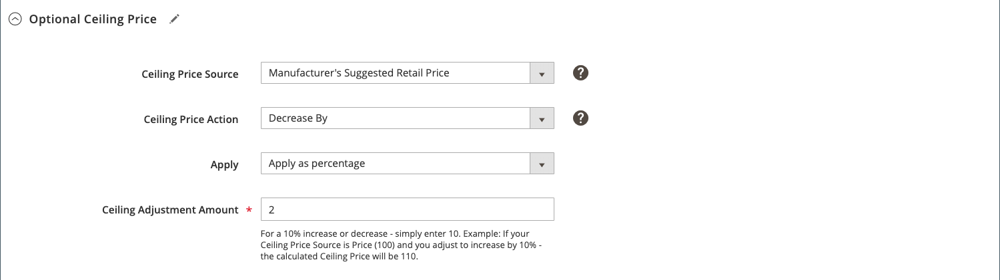

# Regola di prezzo intelligente: prezzo massimo facoltativo

Le sezioni di una regola di rideterminazione intelligente dei prezzi includono:

- [Seleziona tipo di regola](./intelligent-repricing-rules.md)
- [Varianze condizionali della concorrenza](./competitor-conditional-variances.md)
- [Adeguamento del prezzo](./price-adjustment.md)
- [Prezzo base](./floor-price.md)
- Prezzo a soffitto opzionale

Le impostazioni automatizzate dei prezzi massimi proteggono automaticamente il prezzo più elevato del prodotto dalle regole di prezzo intelligenti, consentendo di impostare un tetto (il prezzo più alto) per le regole di prezzo intelligenti.

## Configura il prezzo massimo opzionale

Definisci le impostazioni di prezzo più elevate facoltative nella sezione _[!UICONTROL Optional Ceiling Price]_.

1. Per **[!UICONTROL Ceiling Price Source]**, scegli un attributo.

   Seleziona l&#39; [!DNL Commerce] [attributo di prodotto](https://docs.magento.com/user-guide/catalog/product-attributes.html){:target=&quot;_blank&quot;} che indica il limite di massimale relativo. Ad esempio, se non desideri che il prezzo di listino di Amazon superi il valore MSRP dell’articolo, scegli l’attributo `Manufacturer's Suggested Retail Price` .

1. Per **[!UICONTROL Ceiling Price Action]**, scegli un’opzione.

   - `Decrease By` - Scegli quando vuoi che il  _[!UICONTROL Ceiling Price Source]_valore definito sia regolato verso il basso, creando un prezzo massimo inferiore per la regola, prima di inserirlo in Amazon.

   - `Increase By` - Scegli quando modificare il  _[!UICONTROL Ceiling Price Source]_valore definito, creando un prezzo massimo più alto per la regola, prima di inserirla in Amazon.

   - `Match` - Scegliere quando non si desidera che il prezzo di listino oscilli al di sopra del  _[!UICONTROL Ceiling Price Source]_valore definito. Quando è impostato su `Match`, i campi_[!UICONTROL Apply]_ e _[!UICONTROL Ceiling Adjustment Amount]_sono disabilitati.

1. Lascia il valore predefinito **[!UICONTROL Apply]** come `Apply as percentage`.

1. Per **[!UICONTROL Ceiling Adjustment Price]**, immettere il valore numerico della percentuale per regolare il valore _[!UICONTROL Ceiling Price Source]_.

In questo esempio, il prezzo massimo è fissato al 2% al di sotto del valore MSRP dell&#39;articolo.

| Campo | Descrizione |
|---|---|
| [!UICONTROL Ceiling Price Source] | Scegli l&#39; [!DNL Commerce] [attributo di prodotto](https://docs.magento.com/user-guide/catalog/product-attributes.html){:target=&quot;_blank&quot;} che indica il limite di massimale relativo. Ad esempio, se non desideri che il prezzo di listino dei prodotti superi il valore MSRP dell’articolo, scegli l’attributo `Manufacturer's Suggested Retail Price` . |
| [!UICONTROL Ceiling Price Action] | Scegliere un&#39;azione di adeguamento dei prezzi. Opzioni:<ul><li>**[!UICONTROL Decrease By]** - Scegli quando vuoi che il  _[!UICONTROL Ceiling Price Source]_valore definito sia regolato verso il basso, creando un prezzo massimo inferiore per la regola, prima di inserirlo in Amazon.</li><li>**[!UICONTROL Increase By]** - Scegli quando modificare il  _[!UICONTROL Ceiling Price Source]_valore definito, creando un prezzo massimo più alto per la regola, prima di inserirla in Amazon.</li><li>**[!UICONTROL Match]** - Scegliere quando non si desidera che il prezzo di listino oscilli al di sopra del  _[!UICONTROL Ceiling Price Source]_valore definito. Quando è impostato su `Match`, i campi_[!UICONTROL Apply]_ e _[!UICONTROL Ceiling Adjustment Amount]_sono disabilitati.</li></ul> |
| [!UICONTROL Apply] | **[!UICONTROL Apply as percentage]** - Un aggiustamento percentuale relativo al  _[!UICONTROL Ceiling Price Source]_valore. |
| [!UICONTROL Ceiling Price Adjustment] | Immetti il valore numerico della percentuale per regolare il valore _[!UICONTROL Ceiling Price Source]_. |
