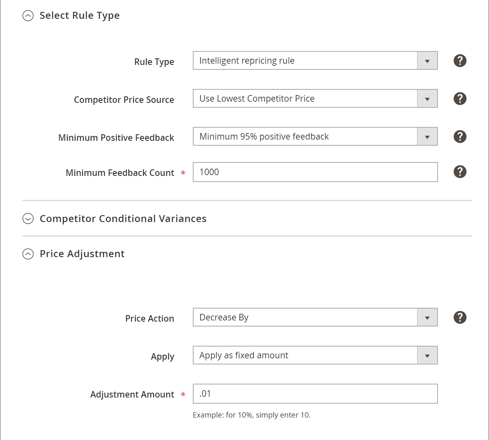

# Esempi di regole di prezzo

## Esempi di regole di prezzo standard

### Elimina regole successive

La possibilità di scartare le regole successive è un&#39;ottima caratteristica all&#39;interno delle regole di determinazione dei prezzi che impedisce a più regole di determinazione dei prezzi di sovrapporsi e di fornire sconti aggiuntivi non intenzionali. Per ignorare le regole successive, una regola di determinazione dei prezzi deve utilizzare le priorità impostate nella _[!UICONTROL Priority]_sezione di [Impostazioni generali regola determinazione prezzi](./pricing-rule-general-settings.md).

Se **[!UICONTROL Discard Subsequent Rules]** è impostato su `Yes`, le regole con priorità inferiore (numeri più alti) non si applicano ai prodotti ammissibili.

Ad esempio, supponiamo che ci siano tre regole di prezzo:

| Esempio | Nome regola | Priorità | Elimina regola successiva |
|----------|----|----|----|
| 1 | 10% di sconto sui prodotti | 1 | No |
| 2 | Prodotti di sconto di $2 | 2 | Sì |
| 3 | 5% di sconto su tutti i prodotti | 3 | No |

In questo scenario, le regole #1 e #2 si applicano ai prodotti idonei. La regola #3 si applica solo ai prodotti idonei non contenuti nel #2 di regole perché ha una priorità inferiore rispetto all’esempio #2 e **[!UICONTROL Discard Subsequent Rules]** è impostato su `Yes`. Pertanto, i prodotti idonei nella categoria di vendita riceverebbero uno sconto del 10% e uno sconto di 2 dollari sul prezzo di vendita di Amazon.

### Applicazione di due regole di prezzo standard

| Campo | Impostazione - Regola 1 | Impostazione - Regola 2 |
|----------|----|----|
| [!UICONTROL Rule Name] | Regola-1 | Articolo 2 |
| [!UICONTROL Priority] | 1 | 2 |
| [!UICONTROL Rule Type] | Regola prezzo standard | Regola prezzo standard |
| [!UICONTROL Price action] | Diminuisci di | Diminuisci di |
| [!UICONTROL Apply] | Applica come percentuale | Applica come importo fisso |
| [!UICONTROL Adjustment Amount] | 10 | 10 |

#### Prodotto 1

Prezzo: $ 45,49

Regola 1 applicata: $45,49 x (0,9) = $40,94

Regola 2 applicata: $40,94 - $10,00 = $30,94

Viene applicato il prezzo finale dopo la regola 1 e la regola 2: $ 30,94

#### Prodotto 2

Prezzo: $ 47,76

Regola 1 applicata: $47,76 x (0,9) = $42,98

Regola 2 applicata: $42,98 - $10,00 = $32,98

Viene applicato il prezzo finale dopo la regola 1 e la regola 2: $ 32,98

## Esempi di regole di rideterminazione dei prezzi intelligenti

### Prezzo Buy Box con prezzo base Origine = Prezzo

| Campo | Impostazione |
|----------|----|
| [!UICONTROL Rule Name] | Regola-1 |
| [!UICONTROL Priority] | 1 |
| [!UICONTROL Rule Type] | Regola di rideterminazione prezzi intelligente |
| [!UICONTROL Competitor Price Source] | Usa prezzo &quot;Buy Box&quot; |
| [!UICONTROL Price Action] | Confronta prezzo concorrente |
| [!UICONTROL Floor Price Source] | Prezzo |
| [!UICONTROL Floor Price Action] | Corrispondenza |

#### Prodotto 1

Prezzo: $15

[Buy Box](./buy-box-competitor-pricing.md) prezzo Amazon: $10

Perché il [Buy Box](./buy-box-competitor-pricing.md) il prezzo è inferiore al prezzo originale, il prodotto è elencato al prezzo originale.

Il prezzo finale dopo l&#39;applicazione della regola: $15

#### Prodotto 2

Prezzo: $5

[Buy Box](./buy-box-competitor-pricing.md) prezzo Amazon: $10

Perché il [Buy Box](./buy-box-competitor-pricing.md) è superiore al prezzo originale, il prodotto è elencato al [Buy Box](./buy-box-competitor-pricing.md) prezzo.

Prezzo finale dopo l&#39;applicazione della regola: $10

### Prezzo Buy Box con origine prezzo base = prezzo e riduzione del prezzo del 20%

| Campo | Impostazione |
|----------|----|
| [!UICONTROL Rule Name] | Regola-1 |
| [!UICONTROL Priority] | 1 |
| [!UICONTROL Rule Type] | Regola di rideterminazione prezzi intelligente |
| [!UICONTROL Competitor Price Source] | Usa prezzo &quot;Buy Box&quot; |
| [!UICONTROL Price Action] | Confronta prezzo concorrente |
| [!UICONTROL Floor Price Source] | Prezzo |
| [!UICONTROL Floor Price Action] | Diminuisci di |
| [!UICONTROL Apply] | Applica come percentuale |
| [!UICONTROL Floor Adjustment Amount] | 20 |

#### Prodotto 1

Prezzo: $20

Prezzo base calcolato: $16

[Buy Box](./buy-box-competitor-pricing.md) prezzo Amazon: $15

Perché il [Buy Box](./buy-box-competitor-pricing.md) il prezzo è minore del valore Calcolato [Prezzo base](./floor-price.md), il prodotto è elencato nel percorso Calcolato [Prezzo base](./floor-price.md).

Il prezzo finale dopo l&#39;applicazione della regola: $16

#### Prodotto 2

Prezzo: $15

Calcolato [Prezzo base](./floor-price.md): $ 12

[Buy Box](./buy-box-competitor-pricing.md) prezzo Amazon: $15

Perché il [Buy Box](./buy-box-competitor-pricing.md) il prezzo è maggiore del valore calcolato [Prezzo base](./floor-price.md), il prodotto è elencato in [Buy Box](./buy-box-competitor-pricing.md) prezzo.

Il prezzo finale dopo l&#39;applicazione della regola: $15

#### Prodotto 3

Prezzo: $17

Prezzo base calcolato: $13,60

[Buy Box](./buy-box-competitor-pricing.md) prezzo Amazon: $15

Perché il [Buy Box](./buy-box-competitor-pricing.md) il prezzo è maggiore del valore calcolato [Prezzo base](./floor-price.md), il prodotto è elencato in [Buy Box](./buy-box-competitor-pricing.md) prezzo.

Il prezzo finale dopo l&#39;applicazione della regola: $15

### Prezzo più basso con tutti i prezzi della concorrenza e utilizzare tutte le condizioni di prodotto della concorrenza

| Campo | Impostazione |
|----------|-----|
| [!UICONTROL Rule Name] | Regola-1 |
| [!UICONTROL Priority] | 1 |
| [!UICONTROL Rule Type] | Regola di rideterminazione prezzi intelligente |
| [!UICONTROL Competitor Price Source] | Utilizza il prezzo concorrente più basso |
| [!UICONTROL Minimum Positive Feedback] | Tutti i prezzi della concorrenza |
| [!UICONTROL Conditional Variance] | Utilizzare tutte le condizioni di prodotto della concorrenza |
| [!UICONTROL Price Action] | Confronta prezzo concorrente |
| [!UICONTROL Floor Price Source] | Prezzo |
| [!UICONTROL Floor Price Action] | Corrispondenza |

| Prezzo | Condizione |
|----------|----|
| $17 | Nuovo |
| $15 | Nuovo |
| $14 | Usato; Molto buono |
| $13 | Usato; buono |

#### Prodotto 1

Prezzo: $10

Condizione: nuova

Poiché il prezzo concorrente più basso per la nuova condizione è di 15 dollari, il prodotto è elencato a 15 dollari.

Il prezzo finale dopo l&#39;applicazione della regola: $15

#### Prodotto 2

Prezzo: $10

Condizione: Utilizzato; Accettabile

Perché il [prezzo concorrente più basso](./lowest-competitor-pricing.md) se la condizione Usato è $13, il prodotto è elencato a $13.

Il prezzo finale dopo l&#39;applicazione della regola: $13

### Regola di rideterminazione prezzi intelligente che combina prezzo massimo, conversione valuta e IVA

| Campo | Impostazione |
|----------|-----|
| [!UICONTROL VAT] | 10% |
| [!UICONTROL Ceiling price source] | $10 |
| [!UICONTROL Currency conversion] | 1,25Euro:1USD |

[Prezzo massimo](./optional-ceiling-price.md) nel mercato europeo (IVA): $10 x 1,25 = $12,50

Quando [prezzo massimo](./optional-ceiling-price.md) nel mercato europeo (IVA), l&#39;IVA viene calcolata e sommata.

Prezzo finale al netto dell&#39;IVA: $12,50 x (1,1) = $13,75

### Combinazione di più regole di determinazione prezzi, prezzo massimo, conversione valuta e IVA

#### Regola di determinazione prezzi intelligente (dall’esempio precedente)

| Campo | Impostazione |
|----------|----|
| Priorità | 1 |
| IVA | 10% |
| Origine prezzo massimo | $10 |
| Conversione valuta | 1,25Euro:1USD |

[Prezzo massimo](./optional-ceiling-price.md) nel mercato europeo (IVA): $10 x 1,25 = $12,50

Prezzo finale al netto dell&#39;IVA: $12,50 x (1,1) = $13,75

#### Regola di determinazione prezzi standard

| Campo | Impostazione |
|----------|-----|
| [!UICONTROL Priority] | 2 |
| [!UICONTROL Price Action] | Aumenta di |
| [!UICONTROL Apply] | Applica come importo fisso |
| [!UICONTROL Adjustment Amount] | $5.00 |

Quando [prezzo massimo](./optional-ceiling-price.md) viene raggiunto, la regola di determinazione prezzi standard viene applicata in aggiunta alla regola di determinazione prezzi intelligente.

Prezzo finale dopo l&#39;applicazione della regola di determinazione prezzi standard: $13,75 + $5,00 = $18,75

### Rettifica prezzo

In questo esempio, il prezzo più competitivo viene definito osservando l’Amazon [il prezzo più basso del concorrente](./lowest-competitor-pricing.md) con un feedback positivo del 95% e un numero minimo di feedback pari a 1.000 recensioni di esercenti.

Dopo aver eseguito questa ricerca in base a questi parametri, il prezzo competitivo torna a 25 $.

Da qui, ci sono tre diversi [azione regola di prezzo](./pricing-rule-actions.md) scelte basate su questo prezzo più basso.

| Campo | Descrizione |
|--- |--- |
| [!UICONTROL Price Action] | Opzioni:<ul><li>**[!UICONTROL Decrease By]** - Questa opzione riduce il prezzo dell&#39;inserzione rispetto al [prezzo concorrente più basso](./lowest-competitor-pricing.md).</li><li>**[!UICONTROL Increase By]** - Questa opzione aumenta il prezzo di inserzione rispetto al [prezzo concorrente più basso](./lowest-competitor-pricing.md).</li><li>**[!UICONTROL Match Competitor Price]** : questa opzione consente di modificare il prezzo di vendita di Amazon in modo che corrisponda al prezzo più basso in base ai parametri. Nell’esempio, il prezzo di vendita di Amazon è di $25.</li></ul> |
| [!UICONTROL Apply] | Opzioni: Applica come percentuale / Applica come importo fisso |
| [!UICONTROL Adjustment Amount] | Valore numerico per definire la percentuale o l&#39;importo fisso per lo sconto da applicare.  Queste selezioni si traducono nel prendere il prezzo più basso e impostarlo a $ 0,01 meno. |

### Prezzo base

| Campo | Impostazione |
|----------|----|
| [!UICONTROL Floor Price Source] | Costo = $5 |
| [!UICONTROL Floor Price Action] | Aumenta di |
| [!UICONTROL Apply] | Applica come percentuale |
| [!UICONTROL Floor Adjustment Amount] | 5 |

[Prezzo base](./floor-price.md) calcolo = Origine prezzo minimo `$5` x Importo adeguamento minimo `5%` = 5,25 $

Quando viene applicata la regola di determinazione prezzi intelligente, il prezzo di listino non può essere inferiore a 5,25 $ per questo prodotto specifico quando il costo è di 5 $.
