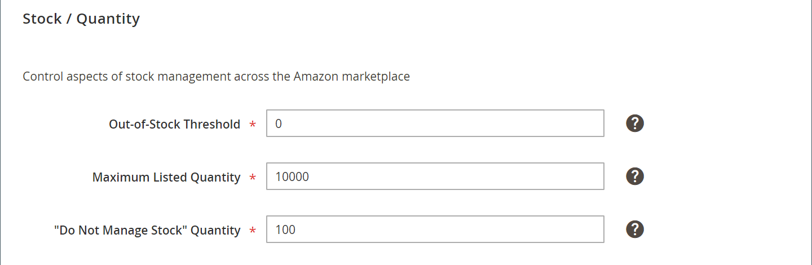

# Magazzino/Quantità

*[!UICONTROL Stock/Quantity]* Le impostazioni fanno parte delle impostazioni dell&#39;inserzione del Negozio. Le impostazioni dell&#39;inserzione sono accessibili da [dashboard store](./amazon-store-dashboard.md).

Queste impostazioni vengono utilizzate per sincronizzare i dettagli della quantità di prodotto dal tuo [!DNL Commerce] vetrina per la quantità sul tuo [!DNL Amazon Seller Central] account. Questo strumento è potente e può essere utilizzato per pubblicità aggiuntiva visualizzando l&#39;urgenza all&#39;acquirente mantenendo il tuo inventario organizzato. Ad esempio, alcuni commercianti potrebbero avere in magazzino 150 articoli di una particolare SKU e desiderano assicurarsi che gli acquirenti Amazon possano acquistare tutto il loro inventario. Altri commercianti potrebbero voler elencare un solo elemento alla volta per creare un senso di scarsità per l&#39;utente finale. In questo caso, imposta *[!UICONTROL Maximum Listed Quantity]* a `1`.

La quantità è un attributo regionale e si basa sulla **[!UICONTROL Amazon Marketplace Country]** impostazione definizione durante [integrazione store](./store-integration.md). Quando viene apportata una modifica alla quantità di un prodotto, tale modifica influisce su tutte le inserzioni di Amazon che condividono [!DNL Amazon Seller SKU] nei tuoi negozi Amazon che vendono nello stesso paese. Una modifica a una condivisione [!DNL Amazon Seller SKU] negli Stati Uniti non influisce sugli store Amazon configurati per un altro paese. Il primo archivio Amazon integrato (con la data di creazione meno recente) controlla la priorità nelle impostazioni relative alla quantità.

>[!NOTE]
>
>Per gli utenti di Adobe Commerce e Magenti Open Source 2.3.x, il canale di vendita Amazon supporta l’utilizzo dell’estensione Inventory management senza alcuna configurazione aggiuntiva. Consulta [Gestione dell’inventario](https://docs.magento.com/user-guide/v2.3/catalog/inventory-management.html){target="_blank"}.

## Configura impostazioni scorte/quantità {#configure-stock--quantity-settings}

1. Clic **[!UICONTROL Listing Settings]** nel dashboard del negozio.

1. Espandi **[!UICONTROL Stock / Quantity]** sezione.

1. Per **[!UICONTROL Out-of-Stock Threshold]** (obbligatorio), inserisci un valore numerico per la quantità minima di un prodotto in modo che possa essere inserito nell’elenco di Amazon.

   Il valore predefinito è `0`. Se il [!DNL Commerce] le scorte dei prodotti sono inferiori a questo numero, la rispettiva inserzione Amazon non è idonea per le vendite tramite Amazon.

1. Per **[!UICONTROL Maximum Listed Quantity]** (obbligatorio), inserisci un valore numerico per la quantità da mostrare nell’inserzione di Amazon.

   Questa impostazione elenca tutte le inserzioni idonee di Amazon al valore inserito. Quando un articolo viene venduto, la quantità dell&#39;inserzione Amazon non cambia. La quantità disponibile per l&#39;inserzione utilizza sempre questo valore, anche quando la quantità di prodotto effettiva è maggiore o minore. Questa impostazione viene in genere utilizzata quando non si gestisce l’inventario dei prodotti. Ad esempio, puoi avere un prodotto con una quantità di 80 nella tua [!DNL Commerce] catalogo. Con impostato su `10`, nell’elenco di Amazon viene sempre visualizzata una quantità disponibile di `10` e non cambia quando viene effettuata la vendita del prodotto.

1. Per **[!UICONTROL "Do Not Manage Stock" Quantity]** (obbligatorio), inserisci un valore di quantità da mostrare per le inserzioni Amazon.

   Amazon richiede la pubblicazione di una quantità disponibile. Per [!DNL Commerce] prodotti impostati per non gestire le scorte ma che si desidera elencare su Amazon, l&#39;elenco viene pubblicato con la quantità disponibile immessa qui.

1. Al termine, fai clic su **[!UICONTROL Save listing settings]**.

| Campo | Descrizione |
|---|---|
| [!UICONTROL Out-of-Stock Threshold] | Immettere un valore numerico per la quantità minima di un prodotto in modo che il prodotto possa essere inserito nell&#39;elenco Amazon (il valore predefinito è `0`).  Se il [!DNL Commerce] le scorte dei prodotti sono inferiori a questo numero, la rispettiva inserzione Amazon non è idonea per le vendite tramite Amazon. |
| [!UICONTROL Maximum Listed Quantity] | Immetti un valore numerico per la quantità da mostrare nell’inserzione di Amazon.  Quando un articolo viene venduto, l&#39;inserzione Amazon viene ripubblicata con la quantità inserita qui. Questa impostazione viene in genere utilizzata quando non si gestisce l’inventario dei prodotti.  Ad esempio, si inserisce il valore Quantità massima elencata come `10`. La quantità effettiva per un prodotto è `80`. Poiché hai impostato questo valore su `10`, nell’elenco di Amazon viene sempre visualizzata una quantità disponibile di `10`. La quantità disponibile viene sempre visualizzata con il valore definito, anche quando la quantità di scorte è inferiore. |
| [!UICONTROL "Do Not Manage Stock" Quantity] | Immetti un valore per la quantità visualizzata per le inserzioni Amazon.  Amazon richiede la pubblicazione di una quantità disponibile. Per [!DNL Commerce] prodotti impostati per non gestire le scorte ma che desideri elencare su Amazon, l’elenco viene pubblicato con la quantità disponibile del valore inserito qui. |

**Accesso rapido** - [!UICONTROL Listing Settings] sezioni

- [[!UICONTROL Product Listing Actions]](./product-listing-actions.md)
- [[!UICONTROL Third Party Listings]](./third-party-listing-settings.md)
- [[!UICONTROL Listing Price]](./listing-price.md)
- [[!UICONTROL (B2B) Business Price]](./business-pricing.md)
- [[!UICONTROL Stock / Quantity]](./stock-quantity.md)
- [[!UICONTROL Fulfilled By]](./fulfilled-by.md)
- [[!UICONTROL Catalog Search]](./catalog-search.md)
- [[!UICONTROL Product Listing Condition]](./product-listing-condition.md)

## Esempio: quantità massima elencata

Quando un articolo viene venduto, l&#39;inserzione Amazon lo rimette in vendita nella quantità specificata.

Ad esempio, se imposti *[!UICONTROL Maximum Listed Quantity]* as `12`, l’elenco di Amazon mostra una quantità di 12 anche se il prodotto ha [!DNL Commerce] quantità di 80:

Se si imposta *[!UICONTROL Maximum Listed Quantity]* as `1`, tutti i prodotti ammissibili sono elencati con un quantitativo di `1`. Quando un articolo viene venduto, il sistema visualizza [!DNL Commerce] prodotto e, se sono presenti scorte aggiuntive, rimette in vendita l&#39;articolo su Amazon con una quantità di `1`.

Questa opzione potrebbe essere utile per i prodotti che in genere vengono ordinati a una quantità pari a 1. Inoltre, aumenta l’urgenza per l’acquirente quando visualizza l’inserzione Amazon.

