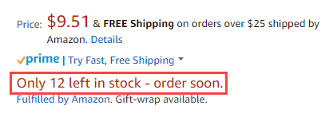
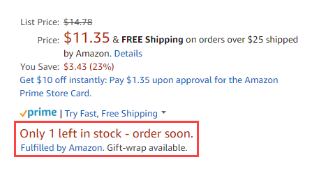

# [!UICONTROL Stock/Quantity]

Le impostazioni di *[!UICONTROL Stock/Quantity]* fanno parte delle impostazioni dell&#39;inserzione dello store. Le impostazioni dell&#39;inserzione sono accessibili dal [dashboard dell&#39;archivio](./amazon-store-dashboard.md).

Queste impostazioni vengono utilizzate per sincronizzare i dettagli della quantità di prodotto dalla vetrina [!DNL Commerce] alla quantità nel tuo account [!DNL Amazon Seller Central]. Questo strumento è potente e può essere utilizzato per pubblicità aggiuntiva visualizzando l&#39;urgenza all&#39;acquirente mantenendo il tuo inventario organizzato. Ad esempio, alcuni commercianti potrebbero avere in magazzino 150 articoli di una particolare SKU e desiderano assicurarsi che gli acquirenti Amazon possano acquistare tutto il loro inventario. Altri commercianti potrebbero voler elencare un solo elemento alla volta per creare un senso di scarsità per l&#39;utente finale. In questo caso, impostare *[!UICONTROL Maximum Listed Quantity]* su `1`.

Quantity è un attributo regionale e si basa sull&#39;impostazione **[!UICONTROL Amazon Marketplace Country]** definita durante l&#39;integrazione dello store](./store-integration.md). [ Quando viene apportata una modifica alla quantità di un prodotto, la modifica interessa tutte le inserzioni di Amazon che condividono [!DNL Amazon Seller SKU] nei tuoi negozi Amazon che vendono nello stesso paese. Una modifica a un [!DNL Amazon Seller SKU] condiviso negli Stati Uniti non influisce sugli store Amazon configurati per un altro paese. Il primo archivio Amazon integrato (con la data di creazione meno recente) controlla la priorità nelle impostazioni relative alla quantità.

>[!NOTE]
>
>Per gli utenti di Adobe Commerce e Magento Open Source 2.3.x, il canale di vendita Amazon supporta l’utilizzo dell’estensione Inventory management senza alcuna configurazione aggiuntiva. Vedi [Gestione dell&#39;inventario](https://docs.magento.com/user-guide/v2.3/catalog/inventory-management.html){target="_blank"}.

## Configura impostazioni scorte/quantità {#configure-stock--quantity-settings}

1. Fare clic su **[!UICONTROL Listing Settings]** nel dashboard dell&#39;archivio.

1. Espandere la sezione **[!UICONTROL Stock / Quantity]**.

1. Per **[!UICONTROL Out-of-Stock Threshold]** (obbligatorio), immettere un valore numerico per la quantità minima di un prodotto in modo che il prodotto possa essere inserito nell&#39;elenco di Amazon.

   Il valore predefinito è `0`. Se le scorte di prodotto di [!DNL Commerce] sono inferiori a questo numero, le rispettive inserzioni Amazon non sono idonee per le vendite tramite Amazon.

1. Per **[!UICONTROL Maximum Listed Quantity]** (obbligatorio), immetti un valore numerico per la quantità da mostrare nell&#39;inserzione Amazon.

   Questa impostazione elenca tutte le inserzioni idonee di Amazon al valore inserito. Quando un articolo viene venduto, la quantità dell&#39;inserzione Amazon non cambia. La quantità disponibile per l&#39;inserzione utilizza sempre questo valore, anche quando la quantità di prodotto effettiva è maggiore o minore. Questa impostazione viene in genere utilizzata quando non si gestisce l’inventario dei prodotti. Ad esempio, è possibile che nel catalogo [!DNL Commerce] sia presente un prodotto con una quantità di 80 unità. Con impostato su `10`, l&#39;inserzione Amazon mostra sempre una quantità disponibile di `10` e non cambia quando viene effettuata la vendita del prodotto.

1. Per **[!UICONTROL "Do Not Manage Stock" Quantity]** (obbligatorio), inserisci un valore di quantità da mostrare per le inserzioni Amazon.

   Amazon richiede la pubblicazione di una quantità disponibile. Per [!DNL Commerce] prodotti impostati per non gestire le scorte ma che si desidera elencare in Amazon, l&#39;elenco viene pubblicato con la quantità disponibile immessa qui.

1. Al termine, fare clic su **[!UICONTROL Save listing settings]**.

{width="600" zoomable="yes"}

| Campo | Descrizione |
|---------------------------------------------|--------------------------------------------------------------------------------------------------------------------------------------------------------------------------------------------------------------------------------------------------------------------------------------------------------------------------------------------------------------------------------------------------------------------------------------------------------------------------------------------------------------------------------------------------------------------------------------------------|
| [!UICONTROL Out-of-Stock Threshold] | Immettere un valore numerico per la quantità minima di un prodotto per mantenere il prodotto idoneo per l&#39;elenco Amazon (il valore predefinito è `0`).  Se le scorte di prodotto di [!DNL Commerce] sono inferiori a questo numero, le rispettive inserzioni Amazon non sono idonee per le vendite tramite Amazon. |
| [!UICONTROL Maximum Listed Quantity] | Immetti un valore numerico per la quantità da mostrare nell’inserzione di Amazon.  Quando un articolo viene venduto, l&#39;inserzione di Amazon viene ripubblicata con la quantità immessa qui. Questa impostazione viene in genere utilizzata quando non si gestisce l’inventario dei prodotti.  Ad esempio, si immette il valore Quantità massima elencata come `10`. La quantità effettiva per un prodotto è `80`. Poiché hai impostato questo valore su `10`, nell&#39;elenco di Amazon viene sempre visualizzata una quantità disponibile di `10`. La quantità disponibile viene sempre visualizzata con il valore definito, anche quando la quantità di scorte è inferiore. |
| [!UICONTROL "Do Not Manage Stock" Quantity] | Immetti un valore per la quantità visualizzata per le inserzioni Amazon.  Amazon richiede la pubblicazione di una quantità disponibile. Per [!DNL Commerce] prodotti impostati per non gestire le scorte ma che si desidera elencare in Amazon, l&#39;elenco viene pubblicato con la quantità disponibile del valore inserito qui. |

**Accesso rapido** - [!UICONTROL Listing Settings] sezioni

- [[!UICONTROL Product Listing Actions]](./product-listing-actions.md)
- [[!UICONTROL Third Party Listings]](./third-party-listing-settings.md)
- [[!UICONTROL Listing Price]](./listing-price.md)
- [[!UICONTROL (B2B) Business Price]](./business-pricing.md)
- [[!UICONTROL Stock / Quantity]](./stock-quantity.md)
- [[!UICONTROL Fulfilled By]](./fulfilled-by.md)
- [[!UICONTROL Catalog Search]](./catalog-search.md)
- [[!UICONTROL Product Listing Condition]](./product-listing-condition.md)

## Esempio: quantità massima elencata

Quando un articolo viene venduto, l&#39;inserzione Amazon lo rimette in vendita nella quantità specificata.

Se ad esempio si imposta *[!UICONTROL Maximum Listed Quantity]* come `12`, l&#39;elenco di Amazon mostra una quantità di 12 anche se il prodotto ha una quantità di [!DNL Commerce] di 80:

{width="300"}

Se si imposta *[!UICONTROL Maximum Listed Quantity]* come `1`, vengono elencati tutti i prodotti idonei con una quantità di `1`. Quando un articolo viene venduto, il sistema cerca il prodotto [!DNL Commerce] e, se esistono scorte aggiuntive, lo rimette in vendita su Amazon con una quantità di `1`.

Questa opzione potrebbe essere utile per i prodotti che in genere vengono ordinati a una quantità pari a 1. Inoltre, aumenta l’urgenza per l’acquirente quando visualizza l’inserzione Amazon.

{width="300"}
