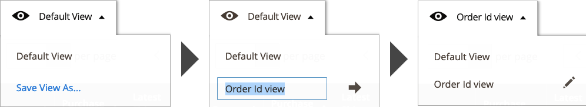

# Controlli di Workspace

Canale di vendita Amazon [home page](./amazon-sales-channel-home.md) dispone di alcuni controlli comuni dell&#39;area di lavoro, tra cui Filtri, Visualizzazione predefinita, Colonne ed Esporta. Non tutte le pagine hanno le stesse opzioni di controllo.

{width="600" zoomable="yes"}

## Azioni

Il _[!UICONTROL Actions]_Il selettore fornisce un elenco di azioni disponibili per un utente per una pagina. Quando viene selezionata, l’azione viene applicata a tutti gli elementi selezionati. Per applicare un&#39;azione a un elemento specifico, seleziona la casella di controllo nella prima colonna di ciascun elemento e scegli un&#39;opzione in_[!UICONTROL Actions]_.

Ad esempio, quando il selettore viene visualizzato sul _[!UICONTROL Attributes]_, include la_[!UICONTROL Re-import Product Attribute Values]_ azione. La scelta di questa azione comporta il ping del corrispondente [!DNL Amazon Seller Central] e aggiorna la [!DNL Commerce] dati per ciascuno degli elementi dell’archivio Amazon selezionati nella colonna a sinistra.

{width="500"}

## Filtri

Il _[!UICONTROL Filters]_mostra le opzioni per restringere i dati visualizzati nella tabella. Le opzioni filtro si basano sulle colonne selezionate nel controllo Colonne. Le opzioni di filtro vengono visualizzate solo per le colonne abilitate nel controllo Columns.

I controlli Filtri possono includere calendari dinamici per limitare i dati per date specifiche, menu a discesa per colonne con selezioni predefinite e campi di testo libero che possono contenere dati personalizzati.

Nell&#39;esempio seguente vengono illustrate le impostazioni per filtrare l&#39;elenco degli ordini in modo da visualizzare solo gli ordini che soddisfano i criteri seguenti:

- gli ordini effettuati tra il 2/01/2019 e il 2/07/2019, e
- Ordini con un buyer denominato `Smith`, e
- Ordini con stato `Shipped`.

Dopo aver impostato le opzioni di filtro, fai clic su **[!UICONTROL Apply Filters]** per filtrare i dati elencati. Fare clic su Annulla per uscire dal controllo Filtri senza applicare.

{width="600" zoomable="yes"}

Dopo aver applicato i filtri ai dati, **[!UICONTROL Active Filters]** verranno visualizzate le informazioni. Puoi fare clic su  per cancellare un’opzione di filtro specifica o fai clic su **[!UICONTROL Clear All]** per cancellare tutti i filtri applicati.

{width="700"}

## Visualizza

Il controllo View si basa sulle colonne predefinite della pagina, pertanto viene denominato Default View (Visualizzazione predefinita). È possibile aggiungere o rimuovere le colonne disponibili utilizzando il controllo Colonne. Quando si personalizzano le colonne, è quindi possibile salvare la visualizzazione come visualizzazione personalizzata nel controllo Visualizzazione.

Quando hai aggiunto o rimosso le colonne dalla visualizzazione della pagina:

1. Clic **[!UICONTROL Default View]** > **[!UICONTROL Save View As...]**.

1. Immettere un nome per la visualizzazione.

1. Per salvare la visualizzazione personalizzata, fai clic sull’icona a forma di freccia.

In questo esempio, la proprietà _ID ordine_ viene aggiunta nel controllo Column e salvata come visualizzazione personalizzata. Dopo il salvataggio del nome della visualizzazione personalizzata, il nome della visualizzazione è stato modificato da _Visualizzazione predefinita_ al nome immesso.

È possibile passare da una visualizzazione all&#39;altra selezionando la visualizzazione desiderata nel _[!UICONTROL View]_menu.

Per eliminare o modificare il nome della visualizzazione personalizzata, fare clic sull&#39;icona della matita. Puoi quindi immettere un nome diverso oppure fare clic sull’icona del cestino per eliminare la visualizzazione personalizzata. Impossibile eliminare la visualizzazione predefinita.

## Colonne

Il controllo Columns consente di aggiungere o rimuovere colonne di dati dalla visualizzazione della pagina. Ogni pagina del canale di vendita di Amazon dispone di una combinazione predefinita di colonne di dati, ma la maggior parte delle pagine dispone di colonne aggiuntive. Se non sono disponibili colonne aggiuntive, è comunque possibile rimuovere le colonne predefinite dalla visualizzazione.

Nell&#39;esempio seguente viene illustrato un controllo Columns. Le opzioni selezionate corrispondono alle intestazioni di colonna visualizzate nella pagina.

- Per aggiungere una colonna di dati alla pagina, seleziona la casella di controllo.
- Per rimuovere una colonna di dati dalla pagina, non selezionare la casella di controllo.

{width="400"}

Le modifiche apportate alla casella di controllo vengono visualizzate immediatamente. Se si apportano modifiche e si esce dalla pagina, questa ritorna alla visualizzazione di colonna predefinita. Per le modifiche apportate regolarmente, è possibile salvare le modifiche apportate alle colonne come visualizzazione personalizzata nel controllo Visualizza. È quindi possibile attivare o disattivare il controllo Visualizza senza dover aggiungere o rimuovere manualmente le colonne.

Puoi fare clic su **[!UICONTROL Reset]** per ripristinare le impostazioni predefinite oppure fare clic su **[!UICONTROL Cancel]** per uscire senza le modifiche.

## Esporta

L&#39;opzione Esporta consente di esportare i dati in un file di dati che può essere importato in un software di terze parti o in un database separato. I dati esportati sono limitati ai dati visualizzati. Se necessario, assicurarsi di aggiungere o rimuovere colonne prima di utilizzare il controllo Esporta.

Quando sei pronto per esportare i dati, scegli un’opzione di formato di esportazione e fai clic su **[!UICONTROL Export]**.

- CSV: un file di valori separati da virgole contenente dati in testo normale
- XML di Excel: un formato di dati di foglio di calcolo basato su XML (in genere utilizzato per gli utenti di Excel)

Il file di dati generato viene salvato automaticamente nella cartella specificata per i download.

{width="250"}
