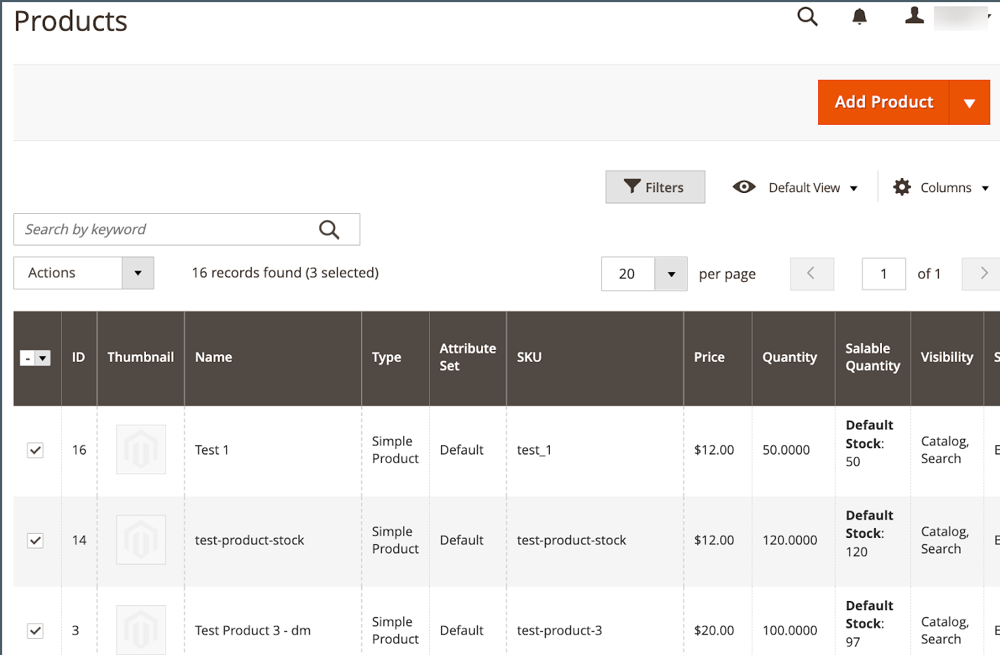

# Aggiungi prodotti a [!DNL Channel Manager]

Per aggiungere prodotti al canale di vendita [!DNL Walmart Marketplace], selezionarli dal catalogo prodotti [!DNL Commerce] e importarli in [!DNL Channel Manager].
Il processo di importazione può richiedere fino a 30 minuti o più, a seconda del numero di prodotti selezionati.

## Prerequisito

**[Mappa attributi catalogo](map-catalog-attributes.md)**. Nella configurazione [!DNL Channel Settings], mappare almeno un attributo del catalogo prodotti [!DNL Commerce] a uno degli identificatori di prodotto Walmart richiesti: GTIN, ISBN, ISSN, UPC, EAN.

## Requisiti dell’inserzione

[!DNL Commerce] elenchi di prodotti devono avere la seguente configurazione attributo richiesta:

- Attributo **[!UICONTROL Connect to Channel Manager]** abilitato

- Fornire valori validi per gli attributi Walmart richiesti.

   - Almeno un attributo di prodotto che corrisponde a uno degli identificatori di prodotto [!DNL Walmart Marketplace] richiesti: GTIN, ISBN, ISSN, UPC, EAN.

   - Prezzo del prodotto specificato con un massimo di due cifre decimali, ad esempio `9.99`

   - Peso del prodotto specificato fino a un massimo di due cifre decimali, ad esempio `1.25`

>[!TIP]
>
>Per ulteriori informazioni sull&#39;ottimizzazione delle inserzioni per il tuo canale di vendita, consulta la [Guida all&#39;ottimizzazione della qualità delle inserzioni di Walmart Marketplace](https://marketplace.walmart.com/wp-content/uploads/2020/09/WMP_listing_quality_optimization_guide.pdf).

## Aggiungi prodotti

1. Da un negozio di canali di vendita connesso, selezionare **Aggiungi prodotti** per aprire il catalogo prodotti.

   {width="600" zoomable="yes"}

   Il catalogo viene aperto in una nuova scheda.

1. Dalla griglia prodotti del catalogo, selezionare i prodotti da vendere su [!DNL Walmart Marketplace].

   {width="600" zoomable="yes"}

1. Abilita l&#39;attributo **[!UICONTROL Connect to Channel Manager]** per gli elementi selezionati.

   - Da **[!UICONTROL Actions]**, selezionare **[!UICONTROL Update attributes]**.

   - Scorrere fino all&#39;attributo **[!UICONTROL Connect to Channel Manager]** e abilitarlo.

   - Verificare che gli attributi del prodotto includano almeno uno dei [!DNL Walmart Product IDs] richiesti.

   - Selezionare **[!UICONTROL Save]**.

     Viene visualizzato un messaggio di conferma.

     {width="400"}

     Se il messaggio indica che l&#39;aggiornamento è pianificato, utilizzare il comando [`queue:consumers:start`](https://experienceleague.adobe.com/docs/commerce-operations/configuration-guide/cli/start-message-queues.html) [!DNL CLI] per elaborarlo immediatamente.

     ```bash
     $ bin/magento queue:consumers:start product_action_attribute.update
     ```

1. Al termine dell&#39;operazione di importazione, verificare i prodotti aggiunti tornando a [!DNL Channel Manager] e selezionando **[!UICONTROL Listings]**.

   I prodotti sono inizialmente nello stato *Bozza*. Selezionare **[!UICONTROL Refresh products]** per aggiornare la tabella.

1. Aggiornare la visualizzazione per visualizzare i nuovi prodotti aggiunti a Channel Manager selezionando la scheda di stato **[!UICONTROL Draft]**.

   {width="400" zoomable="yes"}


