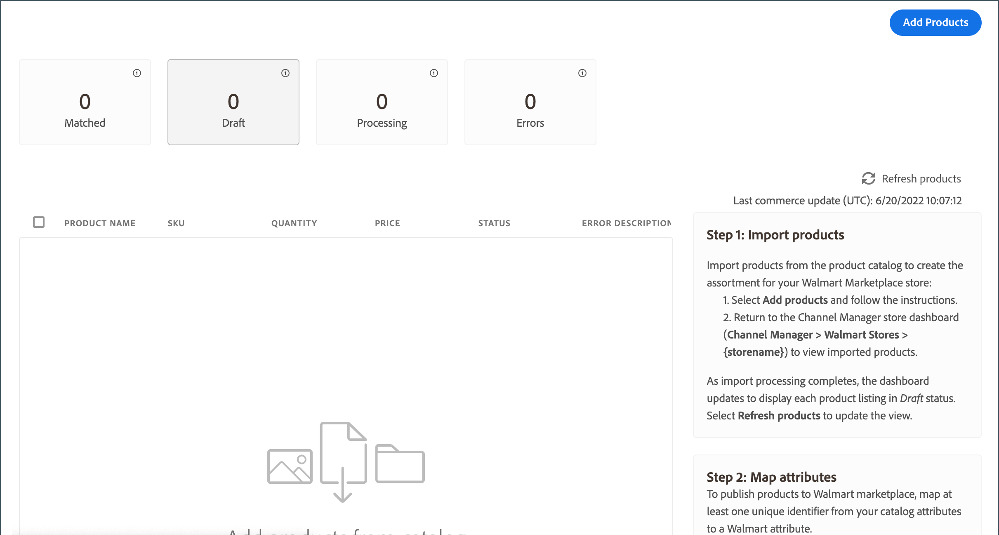

# Aggiungi prodotti all’archivio canali

Da Channel Manager, seleziona i prodotti dalla [!DNL Commerce] catalogo per le vendite di Walmart Marketplace.

Per sincronizzare i prodotti con il canale di vendita, i prodotti selezionati devono avere la seguente configurazione di attributi:

- **[!UICONTROL Publish to Channel Manager]** attributo abilitato

- Almeno un attributo di prodotto deve corrispondere a uno degli [attributi richiesti di Walmart Marketplace](map-product-attributes-for-matching.md)-GTIN, ISBN, ISSN, UPC, EAN

Dopo aver salvato le selezioni, Channel Manager importa i dati di prodotto dal canale. Questo processo può richiedere fino a 30 minuti.

## Aggiungi prodotti al canale di vendita

1. Apri il catalogo di prodotti associato all&#39;archivio di Channel Manager.

   Da un negozio di canali di vendita collegati, seleziona **Aggiungi prodotti**.

   

   Il catalogo si apre in una nuova scheda.

1. Dalla griglia del prodotto di catalogo, seleziona i prodotti da vendere su Walmart Marketplace.

   

1. Abilita la **[!UICONTROL Publish to Channel Manager]** per gli elementi selezionati.

   - Da **[!UICONTROL Actions]**, seleziona **[!UICONTROL Update attributes]**.

   - Scorri fino a **[!UICONTROL Publish to Channel Manager]** e attivarlo.

   - Verifica che gli attributi del prodotto includano almeno uno degli ID di prodotto Walmart richiesti.

   - Seleziona **[!UICONTROL Save]**.

   Viene visualizzato un messaggio di conferma.

   

   Se il messaggio indica che l’aggiornamento è pianificato, utilizza la [coda:consumers:start](https://devdocs.magento.com/guides/v2.4/config-guide/cli/config-cli-subcommands-queue.html) [!DNL CLI] per elaborare immediatamente l&#39;aggiornamento.

   ```bash
   $ bin/magento queue:consumers:start product_action_attribute.update
   ```

1. Torna al canale di vendita collegato in [!DNL Channel Manager].

   Al termine dell’operazione di importazione, visualizza i prodotti da **[!UICONTROL Listings]**. Inizialmente, i prodotti sono in *Bozza* stato. Seleziona [!UICONTROL Refresh products]** per aggiornare la tabella.

   
